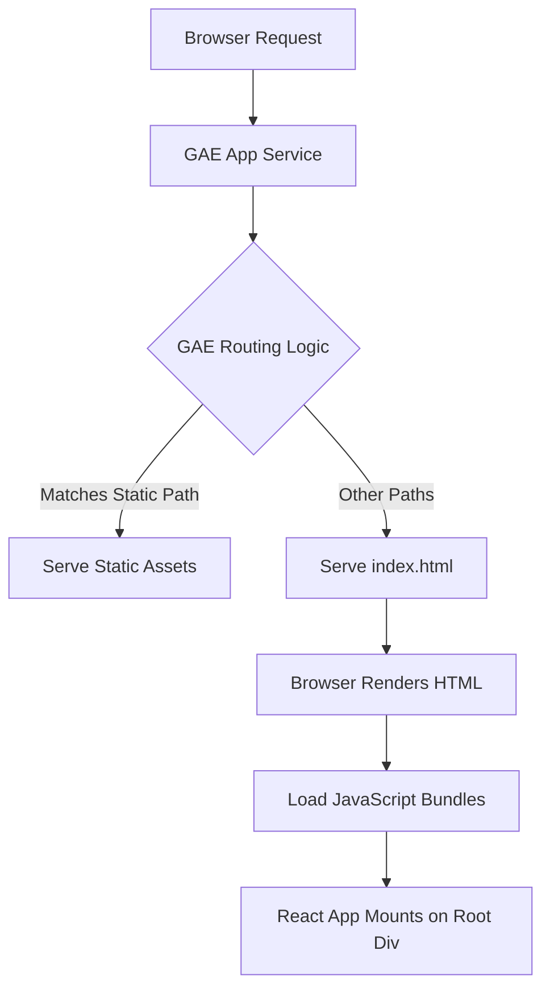

# maxify_frontend — Repository Overview

### High-Level Purpose
The `maxify_frontend` repository defines a Node.js-based React single-page application (SPA) configured for deployment on Google App Engine (GAE). Its primary objective is to serve a dynamic user interface, leverage client-side routing, offer Progressive Web App (PWA) capabilities, and efficiently deliver static assets to users.

### Architectural Structure
The application employs a standard client-side architecture comprising a `public` directory for foundational static assets like `index.html` and `manifest.json`, and a `src` directory containing the application's source code, including React components and styling. Upon build, artifacts are placed into a `build` directory. This frontend application is deployed as the `default` service on Google App Engine, which serves as the hosting and routing infrastructure layer.

### Core Components
*   **React Application**: The primary client-side application responsible for rendering the dynamic user interface, managing state, and handling user interactions.
*   **Google App Engine (GAE) Service**: Provides the deployment environment and defines the URL routing logic to serve the compiled frontend assets and `index.html`.
*   **Build Artifacts**: The compiled static assets (JavaScript bundles, CSS, images, etc.) and the root `index.html` file, generated from the source code.
*   **Web App Manifest (`manifest.json`)**: Configures the application for Progressive Web App features, influencing how it appears and behaves when installed on a user's device.
*   **Styling System**: Custom CSS (`App.css`) along with the Ant Design UI library and TailwindCSS for visual presentation.

### Interaction & Data Flow
A user's browser request initially targets the Google App Engine service. The `app.yaml` configuration directs GAE to either serve specific static assets directly (e.g., from `/static`, `/assets`) or fall back to `build/index.html` for all other requests, enabling client-side routing. Once `index.html` is loaded by the browser, the injected JavaScript bundles execute, mounting the React application onto the `
` element. The React application then manages UI rendering, handles navigation via `react-router-dom`, and communicates with backend services using `axios` for data retrieval and updates.

### Technology Stack
*   **Runtime Environment**: Node.js 20
*   **Deployment Platform**: Google App Engine
*   **Frontend Framework**: React
*   **UI Libraries**: Ant Design, `@ant-design/icons`
*   **Styling**: Custom CSS, TailwindCSS (development dependency)
*   **Routing**: React Router DOM
*   **HTTP Client**: Axios
*   **Build Tooling**: Create React App (via `react-scripts`)
*   **Authentication**: `jwt-decode`
*   **Form Management**: `react-hook-form`
*   **Notifications**: `react-toastify`

### Design Observations
The system leverages a modern Single-Page Application (SPA) architecture, efficiently deployed through Google App Engine's static file serving capabilities and a catch-all route for client-side navigation. The inclusion of a Web App Manifest indicates an intentional design choice to support Progressive Web App features. The project utilizes Create React App, abstracting away complex build configurations and streamlining development. Styling, while structured with Ant Design and TailwindCSS, also employs specific CSS rules with `!important` declarations and explicit `z-index` management, suggesting a precise visual design control that might require careful maintenance.

### System Diagram (Optional)
