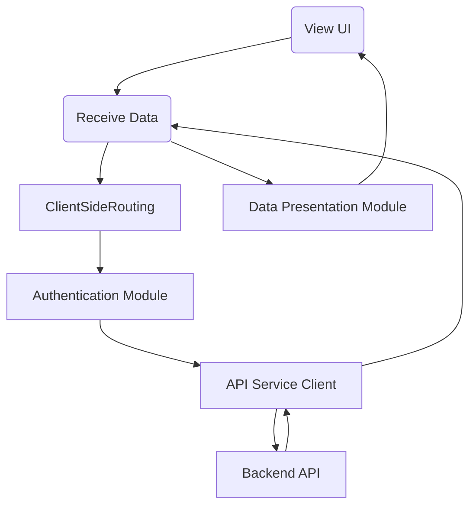

# REPOSITORY_OVERVIEW.md

> **Source File:** [REPOSITORY_OVERVIEW.md](https://github.com/test-company-prowiz/maxify_frontend/blob/main/REPOSITORY_OVERVIEW.md)
> **Repository:** `maxify_frontend`
> **Branch:** `main`

# maxify_frontend — Repository Overview

### High-Level Purpose
The `maxify_frontend` repository provides a user-facing web application designed to display various dashboards for authenticated users. Its primary objective is to fetch user-specific data from a backend API, present it in an organized dashboard interface, and facilitate navigation within the application.

### Architectural Structure
The repository is structured as a client-side React single-page application (SPA). It follows a component-based architecture, organizing UI elements into reusable components and page-level containers.
Key structural elements include:
*   `src/Pages`: Contains top-level components representing distinct application views or pages (e.g., `Home.jsx`).
*   `src/Components`: Houses reusable UI components shared across different pages (e.g., `Header`).
*   `src/Assets`: Stores static assets such as SVG icons.

### Core Components
*   **Page Components**: Components like `Home` that serve as entry points for specific routes, orchestrating data fetching and rendering of sub-components.
*   **Reusable UI Components**: Generic components (e.g., `Header`) that provide consistent UI elements and functionality across the application.
*   **Client-Side Router**: Manages navigation between different application views without full page reloads, using `react-router-dom`.
*   **API Client**: Handles HTTP requests to interact with the backend API, utilizing `axios`.
*   **Authentication Module**: Manages user session state and authentication checks, primarily by inspecting `localStorage`.
*   **Data Presentation Module**: Responsible for rendering fetched data, such as lists of dashboards, often incorporating loading states.

### Interaction & Data Flow
User interaction initiates with navigation to a specific route. The frontend application checks for existing authentication data, typically stored in `localStorage`. If authenticated, it dispatches API requests to the backend to retrieve user-specific information and dashboard data. The backend responds with the requested data, which the frontend then processes and renders into the user interface. User actions, such as clicking on a dashboard item, trigger client-side routing to display detailed views. Unauthenticated or erroneous states lead to redirection to the login page.

### Technology Stack
*   **Frontend Framework**: React
*   **Routing**: React Router DOM
*   **HTTP Client**: Axios
*   **UI Library**: Ant Design (antd) for specific components like `Skeleton`
*   **Styling**: Tailwind CSS for utility-first styling
*   **Language**: JavaScript (ES6+)

### Design Observations
*   **Client-Side Authentication**: The application relies on `localStorage` for managing user sessions and authentication status, which simplifies client-side state but requires careful consideration for security best practices, particularly regarding token storage and invalidation.
*   **User Experience**: Employs loading indicators (e.g., `antd`'s `Skeleton`) to improve perceived performance during data fetching.
*   **External Integrations**: Incorporates direct links to external services for support and plan upgrades, suggesting a modular approach for non-core functionalities.
*   **Configuration**: API endpoints are likely managed through a global constant (`API`), allowing for environment-specific configurations.

### System Diagram

```mermaid
graph TD
User --> FrontendApplication
FrontendApplication --> ClientSideRouting
ClientSideRouting --> AuthenticationModule[Authentication Module]
AuthenticationModule --> ApiServiceClient[API Service Client]
ApiServiceClient --> BackendAPI[Backend API]
BackendAPI --> ApiServiceClient
ApiServiceClient --> FrontendApplication(Receive Data)
FrontendApplication --> DataPresentation[Data Presentation Module]
DataPresentation --> User(View UI)
```