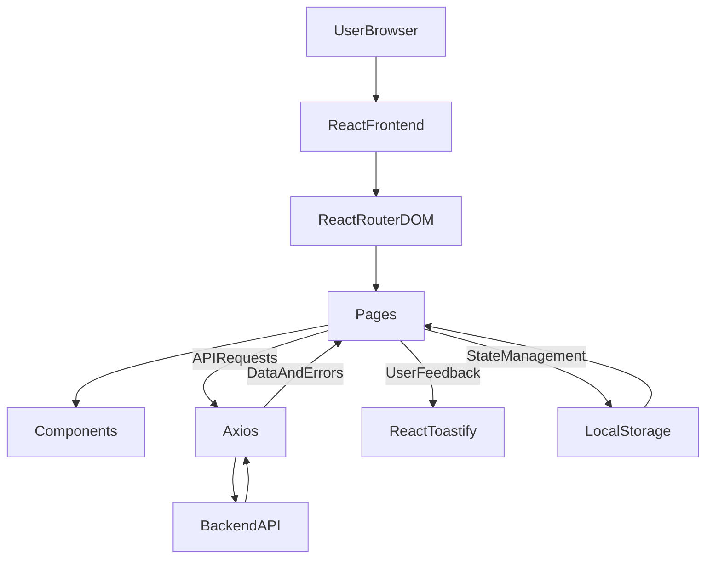

# REPOSITORY_OVERVIEW.md

> **Source File:** [REPOSITORY_OVERVIEW.md](https://github.com/test-company-prowiz/maxify_frontend/blob/main/REPOSITORY_OVERVIEW.md)
> **Repository:** `maxify_frontend`
> **Branch:** `main`

# maxify_frontend — Repository Overview

### High-Level Purpose
The `maxify_frontend` repository provides the client-side user interface for an application that enables users to manage and access their personalized dashboards. Its primary objective is to facilitate user authentication flows (login, password reset) and present a dynamic list of dashboards fetched from a backend service.

### Architectural Structure
The frontend architecture follows a component-based structure typical of React applications, organized into distinct layers:
*   **`src/Pages`**: Contains top-level components that represent full-page views or routes within the application (e.g., `Dashboards`, `ResetPassword`).
*   **`src/Components`**: Houses reusable UI components (e.g., `Header`, `Footer`) that are integrated into various pages.
*   **`src/Assets`**: Stores static assets like images and icons.
*   **Configuration**: The `src/App` file appears to centralize global configurations, such as the `API` base URL.

The application leverages client-side routing to manage navigation between different views.

### Core Components
*   **React Functional Components**: The foundation for building UI elements and pages, managing their state and lifecycle.
*   **`react-router-dom`**: Manages client-side routing, enabling navigation between pages and passing state between routes.
*   **`axios`**: Handles HTTP requests to interact with the backend API for data fetching and submission.
*   **`antd`**: A comprehensive UI library providing a consistent design system and pre-built components (e.g., `Spin`, `Skeleton`) for enhanced user experience.
*   **`react-hook-form`**: Streamlines form management and validation, particularly for user input.
*   **`react-toastify`**: Provides a mechanism for displaying transient user feedback messages (e.g., success, error notifications).
*   **Authentication/Session Management**: Relies on `localStorage` for client-side persistence of user session data.

### Interaction & Data Flow
1.  **User Interaction**: Users interact with the application through forms (e.g., email input for password reset) and navigation elements (e.g., clicking dashboard cards).
2.  **Client-Side Routing**: `react-router-dom` directs users to different application pages based on URL paths.
3.  **API Communication**: User actions or page loads trigger asynchronous `axios` requests to the backend API.
    *   For example, `ResetPassword` sends an email for a password reset link.
    *   `Dashboards` fetches a list of available dashboards for the authenticated user.
4.  **State Management & UI Updates**: Responses from the backend update the React component's state, leading to dynamic UI rendering (e.g., displaying dashboards, showing loading spinners, or error messages).
5.  **Session Persistence**: User authentication status and basic details are stored in `localStorage` to maintain session across page reloads.

### Technology Stack
*   **Frontend Framework**: React
*   **Routing**: React Router DOM
*   **HTTP Client**: Axios
*   **UI Library**: Ant Design (antd)
*   **Form Management**: React Hook Form
*   **Notifications**: React Toastify
*   **Icons**: Ant Design Icons (`@ant-design/icons`)

### Design Observations
*   **Client-Side Session Handling**: The application relies on `localStorage` for maintaining user session information, which is a common pattern but requires careful consideration for security best practices.
*   **Unified UI/UX**: The consistent use of Ant Design components across pages contributes to a cohesive user experience.
*   **Clear Separation of Concerns**: Pages (`src/Pages`) and reusable components (`src/Components`) are logically separated, promoting modularity and maintainability.
*   **Robust Error Handling**: API errors are caught and communicated to the user via toast notifications, enhancing user feedback.
*   **Loading State Feedback**: The integration of `Spin` and `Skeleton` components provides visual cues during data fetching, improving perceived performance.
*   **Dynamic API Base URL**: The `API` constant imported from `src/App` suggests a centralized configuration for backend endpoints, allowing for easier environment management.

### System Diagram

```mermaid
graph TD
A[UserBrowser] --> B[ReactFrontend];
B --> C[ReactRouterDOM];
C --> D[Pages];
D --> E[Components];
D -- APIRequests --> F[Axios];
F --> G[BackendAPI];
G --> F;
F -- DataAndErrors --> D;
D -- UserFeedback --> H[ReactToastify];
D -- StateManagement --> I[LocalStorage];
I --> D;
```