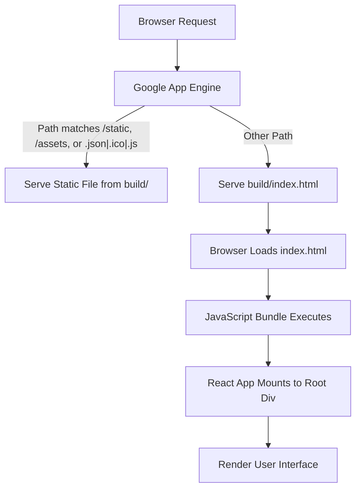

# maxify_frontend — Repository Overview

### High-Level Purpose
The `maxify_frontend` repository hosts the frontend for a React-based Single Page Application (SPA) named "dashworx". Its primary objective is to provide an interactive user interface, designed for deployment on Google App Engine, with a focus on client-side routing, performance optimization, and Progressive Web App (PWA) capabilities.

### Architectural Structure
The repository is structured as a client-side Single Page Application built with React. Its deployment architecture is configured for Google App Engine (GAE) using a `nodejs20` runtime. The `app.yaml` file acts as the primary router for GAE, directing client requests to compiled static assets within a `build/` directory.

The source code is organized as follows:
*   **`public/`**: Contains static assets like `index.html` (the main entry point), `manifest.json` (for PWA features), and other static resources.
*   **`src/`**: Houses the core React application components, including the main `App.js` component, `index.js` (React bootstrap), global and component-specific CSS files (`index.css`, `App.css`), and utility modules (e.g., `reportWebVitals.js`).
*   **Configuration Files**: `package.json` defines project metadata, dependencies, and build scripts. `tailwind.config.js` configures the Tailwind CSS framework.

### Core Components
*   **Google App Engine (GAE) Service**: Configured via `app.yaml`, this service acts as the deployment platform and web server, managing request routing, serving static assets from the `build/` directory, and directing all other requests to `build/index.html` for client-side routing.
*   **React Application Root**: Comprising `public/index.html`, `src/index.js`, and `src/App.js`, this component set bootstraps the React environment, mounts the top-level `App` component into the DOM, and initiates the application's user interface.
*   **Build System & Tooling**: Managed by `react-scripts` (Create React App), which provides scripts for development (`start`), production builds (`build`), testing (`test`), and configuration ejection (`eject`).
*   **Web App Manifest (PWA)**: The `public/manifest.json` file provides metadata for browser integration and Progressive Web App features, enabling "Add to Home Screen" functionality and defining app-like display behavior.
*   **Performance Monitoring**: The `src/reportWebVitals.js` utility, integrated via `src/index.js`, dynamically loads the `web-vitals` library to measure and report Core Web Vitals metrics.
*   **Styling System**: Utilizes Tailwind CSS for a utility-first approach, configured by `tailwind.config.js`, complemented by global styles in `src/index.css` and component-specific styles in `src/App.css`.

### Interaction & Data Flow
A user's browser request first reaches the Google App Engine deployment. The `app.yaml` configuration directs this request to serve either specific static assets (e.g., from `/static`, `/assets`, or files ending in `.json`, `.ico`, `.js`) directly from the `build/` directory, or, for all other paths, serves the `build/index.html` file.

Upon receiving `index.html`, the browser loads the document and its referenced static resources (like `manifest.json` and external fonts). The JavaScript bundle, injected into `index.html` during the build process, executes `src/index.js`. This script then initializes the React application, rendering the main `App` component into the designated `
` element. From this point, the React application manages client-side routing, interacts with backend APIs via HTTP requests (e.g., using Axios), and potentially handles user authentication. Concurrently, performance metrics are collected and reported by the `web-vitals` utility.

### Technology Stack
*   **Deployment**: Google App Engine (GAE), Node.js 20 runtime.
*   **Frontend Framework**: React, React DOM.
*   **Build Tooling**: Create React App (`react-scripts`), PostCSS, Tailwind CSS.
*   **UI Library**: Ant Design (`antd`), Ant Design Icons (`@ant-design/icons`).
*   **Routing**: React Router DOM (`react-router-dom`).
*   **Forms & Validation**: React Hook Form (`react-hook-form`).
*   **HTTP Client**: Axios.
*   **Authentication**: JWT-Decode (`jwt-decode`).
*   **Notifications**: React Toastify (`react-toastify`).
*   **Performance Monitoring**: Web Vitals (`web-vitals`).
*   **Testing**: React Testing Library (`@testing-library/jest-dom`, `@testing-library/react`, `@testing-library/user-event`).
*   **Styling**: Tailwind CSS, custom CSS, Google Fonts ('Quicksand', 'Graphik').

### Design Observations
*   **Single Page Application (SPA) Paradigm**: The architecture is centered around a JavaScript-driven SPA model, where `index.html` serves as the primary shell for client-side rendering and routing, enabled by `react-router-dom` and the `app.yaml` catch-all rule.
*   **Progressive Web App (PWA) Adoption**: The presence of `manifest.json` indicates a strategic embrace of PWA features, aiming to provide an installable, app-like experience with standalone display mode.
*   **Performance-Oriented Development**: Integration of `reportWebVitals` highlights a commitment to monitoring and improving user experience through Core Web Vitals, utilizing dynamic imports to optimize initial load times.
*   **Utility-First Styling with Theming**: The combination of Tailwind CSS and a custom `tailwind.config.js` (defining custom colors) promotes a utility-first styling approach while maintaining brand consistency.
*   **Component-Driven UI with Ant Design**: The use of Ant Design provides a comprehensive, pre-built UI component library, facilitating rapid development and consistent visual design.
*   **Managed Development Workflow**: Leveraging `react-scripts` from Create React App simplifies the underlying build configuration, abstracting away complex Webpack and Babel setups.
*   **Optimized GAE Deployment**: The `app.yaml` configuration is tailored for efficient static asset serving on GAE, including explicit upload patterns for optimized deployment size and caching.
*   **Strict Mode for Development**: `React.StrictMode` is applied globally in `src/index.js`, providing valuable warnings and checks during the development phase.
*   **Unconditional Console Logging Override**: The `console.log` function is unconditionally reassigned to an empty function in `src/index.js` due to a string comparison that always evaluates to true. This silences all console output globally, which may be unintended for development environments.

### System Diagram

```mermaid
graph TD
A[Browser Request] --> B[Google App Engine]
B -- Path matches /static, /assets, or .json|.ico|.js --> C[Serve Static File from build/]
B -- Other Path --> D[Serve build/index.html]
D --> E[Browser Loads index.html]
E --> F[JavaScript Bundle Executes]
F --> G[React App Mounts to Root Div]
G --> H[Render User Interface]
```