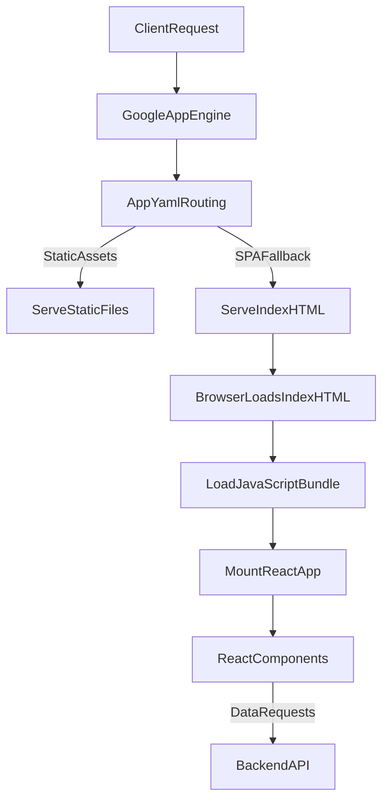

>>> GENERATED USING CUSTOM USER PROMPT <<<
# maxify_frontend — Repository Overview

### High-Level Purpose
This repository hosts the frontend component of the Maxify application, primarily focused on delivering a modern, client-side Single-Page Application (SPA) to users via Google App Engine. Its core functions include user interface rendering, managing client-side routing, implementing user authentication flows (e.g., password reset), and serving as the interactive presentation layer for the overall Maxify system. The application also integrates Progressive Web App (PWA) features to enhance the user experience. This documentation was generated using a custom user prompt override.

### Architectural Structure
The architecture centers on a React-based Single-Page Application deployed and served through Google App Engine (GAE).

*   **Deployment & Serving Layer:** Configured via `app.yaml`, GAE routes incoming requests, serves static assets from a `build` directory, and directs all other requests to the SPA's `index.html` fallback.
*   **Frontend Application Layer:** A React SPA structured into core logic (`App`, `index.js`), reusable UI components (`Components`), distinct views (`Pages`), and static assets (`Assets`, `public/`).
*   **Styling Layer:** Combines global CSS (`index.css`, `App.css`) with Tailwind CSS for utility-first styling and Ant Design for comprehensive UI components.
*   **Build & Configuration Layer:** `package.json` manages dependencies and scripts, `tailwind.config.js` customizes Tailwind CSS, and `public/manifest.json` provides PWA metadata.

Client-side routing is fundamental, with `index.html` as the single entry point, and JavaScript managing subsequent navigation within the application.

### Core Components
*   **Google App Engine (GAE)**: The cloud platform environment hosting and serving the application, configured by `app.yaml`.
*   **`react-scripts`**: The underlying toolchain (from Create React App) responsible for development, building, and testing the React application.
*   **React Application**: The primary UI framework, mounted in `public/index.html` by `src/index.js`, featuring components like `Header` and pages like `PasswordPageReset`.
*   **`react-router-dom`**: Manages client-side navigation within the SPA.
*   **Ant Design (`antd`) & Tailwind CSS**: Provide UI components and a utility-first CSS framework for visual styling.
*   **`react-hook-form`**: Manages form state, validation, and submission logic for user input.
*   **`axios`**: The HTTP client used for asynchronous API interactions with backend services.
*   **Web App Manifest (`public/manifest.json`)**: Configures Progressive Web App (PWA) features, including home screen installation.
*   **`web-vitals` (via `reportWebVitals.js`)**: Monitors key application performance metrics.
*   **`jwt-decode`**: Utility for decoding JSON Web Tokens, likely for client-side authentication context.
*   **`react-toastify`**: Provides notification messages to users.

### Interaction & Data Flow
Upon a client request, Google App Engine, guided by `app.yaml`, serves either specific static assets (e.g., CSS, JS bundles) or the `public/index.html` file as the SPA's entry point. The browser loads `index.html`, which then executes the JavaScript application bundled via `src/index.js`. The React application takes control, mounting its components into the `
` element.

User interactions within the React application, such as submitting the password reset form (`src/Pages/Password.jsx`), trigger asynchronous HTTP requests to a backend API using `axios`. The application manages its local UI state (e.g., loading indicators, dropdown visibility) via React hooks. Authentication-related actions, like "Log Out" in `Header.jsx`, directly clear relevant items from client-side `localStorage`. Global styles from `src/index.css` and `src/App.css`, processed by Tailwind CSS, dictate the application's visual presentation.

### Technology Stack
*   **Runtime Environments**: Node.js 20 (on Google App Engine), Web Browser (client-side execution).
*   **Core Frameworks**: React, Google App Engine.
*   **UI Libraries**: Ant Design (`antd`), Tailwind CSS.
*   **Routing**: `react-router-dom`.
*   **State/Form Management**: `react-hook-form`.
*   **HTTP Client**: `axios`.
*   **Authentication Utilities**: `jwt-decode`.
*   **Notifications**: `react-toastify`.
*   **Performance Monitoring**: `web-vitals`.
*   **Build Tools**: npm/Yarn, PostCSS (for Tailwind CSS), ESLint.
*   **Deployment**: Google App Engine.

### Design Observations
The repository establishes a standard Single-Page Application (SPA) architecture, utilizing `create-react-app`'s `react-scripts` for streamlined development and build processes. The `app.yaml` configuration is critical for efficient static asset delivery and robust client-side routing on Google App Engine, ensuring that all unhandled paths fallback to `index.html`.

Styling adopts a hybrid approach, combining the extensive component library of Ant Design with the flexibility of Tailwind CSS. Explicit `z-index` management and occasional `!important` declarations in `App.css` suggest a precise strategy for UI layering and style overrides. The inclusion of `manifest.json` demonstrates a commitment to Progressive Web App (PWA) features, enabling an installable, app-like experience. Performance is considered with `web-vitals` integration.

The logout mechanism directly clears `localStorage` on the client, which implies a reliance on client-side token expiration rather than explicit server-side session invalidation. Hardcoded API endpoints and routes are present, common in early-stage development. The presence of commented-out or unused code, notably in `Password.jsx`, indicates evolving features or previous design iterations. The global `console.log` override in `index.js` currently silences all logging regardless of environment, which might require refinement for development debugging.

### System Diagram

```mermaid
graph TD
ClientRequest[ClientRequest] --> GoogleAppEngine[GoogleAppEngine]
GoogleAppEngine --> AppYamlRouting[AppYamlRouting]
AppYamlRouting -- StaticAssets --> ServeStaticFiles[ServeStaticFiles]
AppYamlRouting -- SPAFallback --> ServeIndexHTML[ServeIndexHTML]
ServeIndexHTML --> BrowserLoadsIndexHTML[BrowserLoadsIndexHTML]
BrowserLoadsIndexHTML --> LoadJavaScriptBundle[LoadJavaScriptBundle]
LoadJavaScriptBundle --> MountReactApp[MountReactApp]
MountReactApp --> ReactComponents[ReactComponents]
ReactComponents -- DataRequests --> BackendAPI[BackendAPI]
```

### Custom Note
This documentation was generated using a USER-DEFINED PROMPT (NOT DEFAULT).