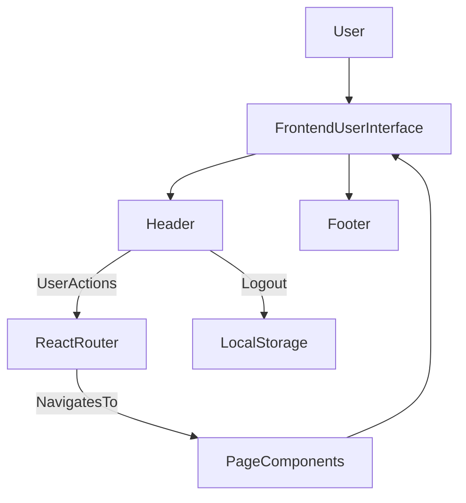

# maxify_frontend — Repository Overview

### High-Level Purpose
The `maxify_frontend` repository provides the client-side user interface for a client portal associated with Maxify Limited. Its primary objective is to offer a consistent user experience, facilitate navigation, manage user sessions, and display application content.

### Architectural Structure
The repository is structured around a component-based frontend architecture, leveraging React. Reusable UI components are organized within a `src/Components` directory. The application uses client-side routing, implying a root application component responsible for orchestrating page layouts and component rendering based on routes.

### Core Components
*   **Header Component**: Provides global navigation, company branding, user account access (Home, Logout, Change Password), and manages user session state locally (e.g., clearing `localStorage` on logout).
*   **Footer Component**: Renders consistent application footers, typically displaying copyright or company information.
*   **React Router**: Handles client-side routing, enabling navigation between different views of the application.
*   **Local Storage**: Used for client-side session data management, specifically for clearing session-related `data` upon user logout.

### Interaction & Data Flow
User interaction primarily occurs through the `Header` component for navigation and account actions. The `Header` interprets user clicks on navigation links or the logo to trigger client-side routing via `react-router-dom`. A user's logout action involves clearing specific data stored in `localStorage`, indicating a client-side session management approach. `Footer` components provide static information and maintain UI consistency.

### Technology Stack
*   **React**: The core JavaScript library for building user interfaces.
*   **react-router-dom**: For declarative routing in a React application.
*   **Tailwind CSS**: Utilized for styling components, often applied directly as utility classes within JSX.
*   **JavaScript (ES6+)**: The primary programming language.

### Design Observations
The frontend adopts a modular, component-driven design which promotes reusability for UI elements like `Header` and `Footer`. Styling is managed using Tailwind CSS directly within components, localizing presentation logic but potentially increasing component complexity. The reliance on `localStorage` for session management implies a client-side token or identifier storage mechanism, which has security implications that should be considered. The `Header` component includes props like `isNavigatable` for conditional behavior, allowing flexibility in navigation contexts.

### System Diagram

```mermaid
graph TD
User[User] --> FrontendUI[FrontendUserInterface];
FrontendUI --> HeaderComponent[Header];
FrontendUI --> FooterComponent[Footer];

HeaderComponent -- UserActions --> Router[ReactRouter];
Router -- NavigatesTo --> PageComponents[PageComponents];
PageComponents --> FrontendUI;

HeaderComponent -- Logout --> LocalStorage[LocalStorage];
```