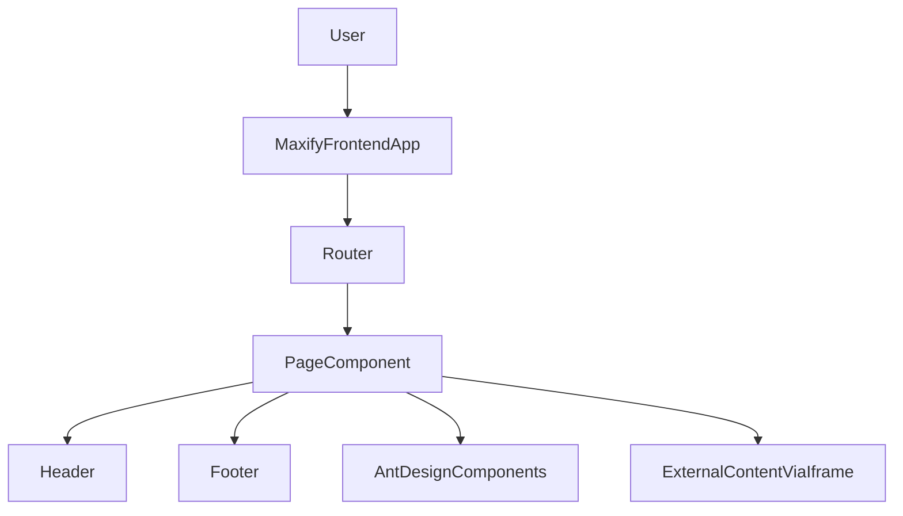

# REPOSITORY_OVERVIEW.md

> **Source File:** [REPOSITORY_OVERVIEW.md](https://github.com/test-company-prowiz/maxify_frontend/blob/main/REPOSITORY_OVERVIEW.md)
> **Repository:** `maxify_frontend`
> **Branch:** `main`

# maxify_frontend — Repository Overview

### High-Level Purpose
The `maxify_frontend` repository appears to host a client-side application designed to serve as a consolidated portal or dashboard. Its primary objective is to integrate and display various external web applications or resources within a unified user interface, leveraging `iframe` elements for content embedding.

### Architectural Structure
The repository follows a standard component-based architecture typical for React applications.
- **`src/Pages`**: Contains top-level view components, each representing a distinct application page (e.g., `Dash.jsx`).
- **`src/Components`**: Houses reusable UI components shared across different pages (e.g., `Header`, `Footer`).
This structure promotes modularity and separation of concerns between page-specific logic and generic UI elements.

### Core Components
- **Page Components**: Components like `Dash` act as containers for specific application views, managing their state and integrating other UI elements.
- **UI Components**: Reusable elements such as `Header` and `Footer` provide consistent navigation and branding across the application.
- **Routing Infrastructure**: `react-router-dom` facilitates client-side navigation and state passing between routes.
- **UI Framework Components**: Ant Design components (e.g., `Spin`, `LoadingOutlined`) are used for standardized visual feedback and styling.

### Interaction & Data Flow
1. A user navigates to a specific route within the application.
2. `react-router-dom` resolves the route and renders the corresponding page component.
3. Page components, such as `Dash`, may receive dynamic data (e.g., an external URL) via router state.
4. The page component manages its internal state, potentially displaying loading indicators.
5. External web content is embedded and displayed using an `iframe`, sourced from the received data.
6. Consistent UI elements like `Header` and `Footer` are rendered alongside the main content.

### Technology Stack
- **React**: The core JavaScript library for building user interfaces.
- **react-router-dom**: Provides declarative routing for React applications.
- **Ant Design**: A UI library offering a set of high-quality components for enterprise-level products.

### Design Observations
The reliance on `iframe` for embedding external content suggests a design pattern focused on aggregating disparate web services or dashboards. This approach requires careful consideration of security implications, such as XSS vulnerabilities and content security policies, especially if external URLs are not strictly controlled. The use of a simulated loading state indicates that actual asynchronous operations will need robust loading management.

### System Diagram

```mermaid
graph TD
A[User] --> B[MaxifyFrontendApp];
B --> C[Router];
C --> D[PageComponent];
D --> E[Header];
D --> F[Footer];
D --> G[AntDesignComponents];
D --> H[ExternalContentViaIframe];
```