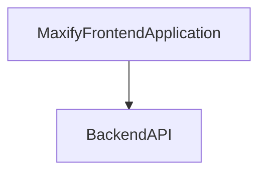

# REPOSITORY_OVERVIEW.md

> **Source File:** [REPOSITORY_OVERVIEW.md](https://github.com/test-company-prowiz/maxify_frontend/blob/main/REPOSITORY_OVERVIEW.md)
> **Repository:** `maxify_frontend`
> **Branch:** `main`

# maxify_frontend — Repository Overview

### High-Level Purpose
The `maxify_frontend` repository hosts the client-side application, primarily serving as the user interface for a larger system. Its objective is to provide interactive views and manage user interactions, including authentication and account management flows like password resets.

### Architectural Structure
This repository appears to implement a Single Page Application (SPA) using React. The `src/Pages` directory structure indicates that the application organizes its UI into distinct top-level views. It represents the presentation layer, responsible for rendering the user interface and handling client-side logic and state.

### Core Components
*   **Page Components:** Top-level React components, such as `ResetPassword`, which encapsulate specific application views and their associated logic.
*   **Form Management:** Utilizes `react-hook-form` for efficient handling of user input, validation, and form state across the application.
*   **Routing & Navigation:** Employs `react-router-dom` to manage client-side navigation between different application pages.
*   **API Interaction Layer:** Integrates `axios` for making HTTP requests to a backend API, abstracting network communication.
*   **UI Component Library:** Leverages `antd` for a consistent set of pre-built UI components and a standardized design system.
*   **Notification System:** Incorporates `react-toastify` to provide user feedback through toast notifications for success or error messages.

### Interaction & Data Flow
The frontend application operates by accepting user input through forms and UI elements. These interactions trigger asynchronous HTTP requests to a backend API (e.g., initiating a password reset via a GET request). Upon receiving responses from the API, the application updates its internal state, modifies the UI accordingly (e.g., displaying success messages, error notifications, or loading indicators), and can programmatically navigate to other routes.

### Technology Stack
*   **Frontend Framework:** React
*   **Routing:** React Router DOM
*   **Form Management:** React Hook Form
*   **HTTP Client:** Axios
*   **UI Component Library:** Ant Design (antd)
*   **Notification Library:** React Toastify

### Design Observations
*   **Component-Based Architecture:** The use of React promotes a modular, reusable, and maintainable UI component structure.
*   **Specialized Library Adoption:** The project effectively delegates common frontend concerns (forms, routing, UI components, notifications) to well-established external libraries, reducing development overhead and leveraging community-vetted solutions.
*   **Clear Client-Server Separation:** The application maintains a distinct separation between its presentation layer and backend services, communicating exclusively via API calls.
*   **User Feedback Mechanisms:** Integration of loading indicators and toast notifications enhances the user experience by providing clear feedback during asynchronous operations and state transitions.

### System Diagram

```mermaid
graph TD
MaxifyFrontendApplication[MaxifyFrontendApplication] --> BackendAPI[BackendAPI]
```