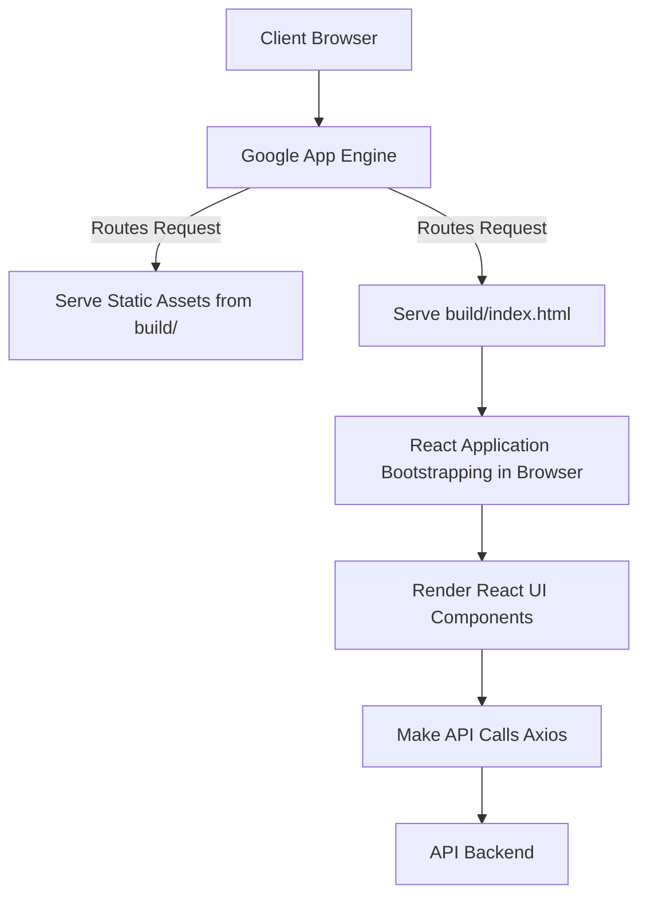

# maxify_frontend — Repository Overview

### High-Level Purpose
The `maxify_frontend` repository provides the client-side single-page application (SPA) for the Maxify platform. Its primary objective is to deliver an interactive user interface, managed by React, that runs in a web browser, handles client-side routing, communicates with a backend API, and is deployed on Google App Engine (GAE) to serve static assets and the application's entry point.

### Architectural Structure
The repository is structured as a standard Create React App frontend, with specific configurations for Google App Engine deployment.

*   **Deployment Layer**: `app.yaml` configures the Google App Engine `default` service, defining the Node.js 20 runtime and request routing for static assets and the main `index.html`.
*   **Root Configuration**: `package.json` serves as the project manifest, specifying dependencies, scripts, and build configurations. `tailwind.config.js` configures the CSS framework.
*   **Public Assets (`public/`)**: Contains static assets like `index.html` (the SPA entry point), `manifest.json` (for PWA capabilities), favicons, and other non-processed assets.
*   **Source Code (`src/`)**: Encapsulates the core application logic, React components, and styling.
    *   `src/index.js`: The application's JavaScript entry point, responsible for bootstrapping React.
    *   `src/App.js` (implied): The root React component.
    *   `src/Pages/`: Contains top-level page components (e.g., `Password.jsx`).
    *   `src/Components/`: Contains reusable UI components (e.g., `Header.jsx`).
    *   `src/Assets/`: Stores image and icon assets.
    *   `src/Fonts/`: Stores custom font files.
    *   `src/index.css`, `src/App.css`: Global and component-specific stylesheets.
    *   `src/reportWebVitals.js`: Utility for performance monitoring.

### Core Components
*   **Google App Engine Service (`app.yaml`)**: Manages the deployment environment and HTTP request routing, serving compiled static assets from the `build/` directory.
*   **React Application Root (`src/index.js`, `public/index.html`)**: Initiates the React application, mounting the main `App` component onto the DOM.
*   **Header Component (`src/Components/Header.jsx`)**: Provides persistent navigation, application branding, and user account actions (e.g., logout, change password).
*   **Password Reset Page (`src/Pages/Password.jsx`)**: A page-level component handling user input for password changes, including form validation and API interaction.
*   **Web App Manifest (`public/manifest.json`)**: Configures the application for Progressive Web App (PWA) features, defining its installable properties and display behavior.
*   **Styling System (`src/index.css`, `src/App.css`, `tailwind.config.js`)**: Manages global styles, custom typography, utility-first CSS (Tailwind), and component-specific overrides.
*   **API Client (`axios`)**: Handles HTTP requests to the backend, enabling data exchange and authentication.
*   **Performance Monitoring (`src/reportWebVitals.js`)**: Collects and reports web performance metrics (Core Web Vitals) for user experience analysis.

### Interaction & Data Flow
1.  A client browser sends an HTTP request to the Google App Engine deployment.
2.  The GAE environment, configured by `app.yaml`, acts as a router:
    *   For requests matching static asset patterns (`/static`, `/assets`, `*.json`, `*.ico`, `*.js`), GAE serves the corresponding files directly from the `build/` directory.
    *   For all other requests (catch-all `.*`), GAE serves `build/index.html`, which is the entry point for the single-page application.
3.  The browser loads `index.html`, which then initiates the execution of the bundled JavaScript application (`src/index.js`).
4.  The React application mounts to the `
` element, rendering the UI.
5.  User interactions (e.g., form submissions, navigation clicks) within React components (e.g., `PasswordPageReset`, `Header`) trigger state changes and/or API calls.
6.  API calls are made using `axios` to a backend service (e.g., `/auth/resetpassword`).
7.  The React application processes responses from the API, updates its state, and re-renders the UI accordingly, often displaying toast notifications for user feedback.
8.  Performance metrics are asynchronously collected and reported via `reportWebVitals`.
9.  User authentication tokens or session data are stored in `localStorage` (e.g., key "data") and cleared on logout.

### Technology Stack
*   **Runtime Environment**: Node.js 20 (on GAE), Web Browser (client-side).
*   **Frontend Framework**: React.js (via `react`, `react-dom`).
*   **Build Tooling**: Create React App (`react-scripts`), npm/Yarn, PostCSS (for Tailwind CSS), ESLint.
*   **Deployment Platform**: Google App Engine (GAE).
*   **UI Libraries**: Ant Design (`antd`), `@ant-design/icons`.
*   **Styling**: Tailwind CSS, custom CSS, Google Fonts.
*   **Routing**: React Router DOM (`react-router-dom`).
*   **Form Management**: React Hook Form (`react-hook-form`).
*   **HTTP Client**: Axios (`axios`).
*   **Authentication Utilities**: `jwt-decode`.
*   **Notifications**: React Toastify (`react-toastify`).
*   **Performance Monitoring**: Web Vitals (`web-vitals`).

### Design Observations
*   **Single Page Application (SPA) Pattern**: The architecture clearly follows the SPA pattern, leveraging client-side routing and a single `index.html` entry point, which is standard for modern web applications.
*   **Google App Engine for Static Hosting**: Using GAE for serving static assets and the SPA shell is an effective choice for scalable and robust frontend deployment.
*   **Hybrid Styling Approach**: The combination of Ant Design for components, Tailwind CSS for utility-first styling, and custom CSS allows for both rapid UI development and fine-grained control, though it could introduce complexity if not well-governed. The heavy use of `!important` in `App.css` might indicate a need to enforce specific styles over library defaults.
*   **Performance Focus**: Integration of `reportWebVitals` signifies a proactive approach to monitoring and improving user experience. The dynamic import of `web-vitals` optimizes initial load times.
*   **Centralized API Configuration**: The use of a global `API` constant (imported from `../App`) is a good practice for managing backend endpoint URLs.
*   **Form Management**: `react-hook-form` is a strong choice for efficient form validation and state management, leading to better performance and developer experience.
*   **Authentication Mechanism**: Reliance on `jwt-decode` and `localStorage` for session `data` implies a JWT-based authentication system, typical for SPAs. However, storing sensitive tokens in `localStorage` carries security considerations, such as XSS vulnerability.
*   **Maintainability Opportunities**: Hardcoded route paths within components (e.g., `Header.jsx`) could be centralized for better maintainability. The presence of commented-out code in `Password.jsx` suggests areas for cleanup or documentation of design decisions. Accessibility of hover-based menus could be reviewed.

### System Diagram

```mermaid
graph TD
ClientBrowser[Client Browser] --> GoogleAppEngine[Google App Engine]
GoogleAppEngine -- Routes Request --> ServeStaticAssets[Serve Static Assets from build/]
GoogleAppEngine -- Routes Request --> ServeIndexHtml[Serve build/index.html]
ServeIndexHtml --> ReactApplicationBootstrapping[React Application Bootstrapping in Browser]
ReactApplicationBootstrapping --> RenderReactUi[Render React UI Components]
RenderReactUi --> MakeApiCalls[Make API Calls Axios]
MakeApiCalls --> BackendApi[API Backend]
```