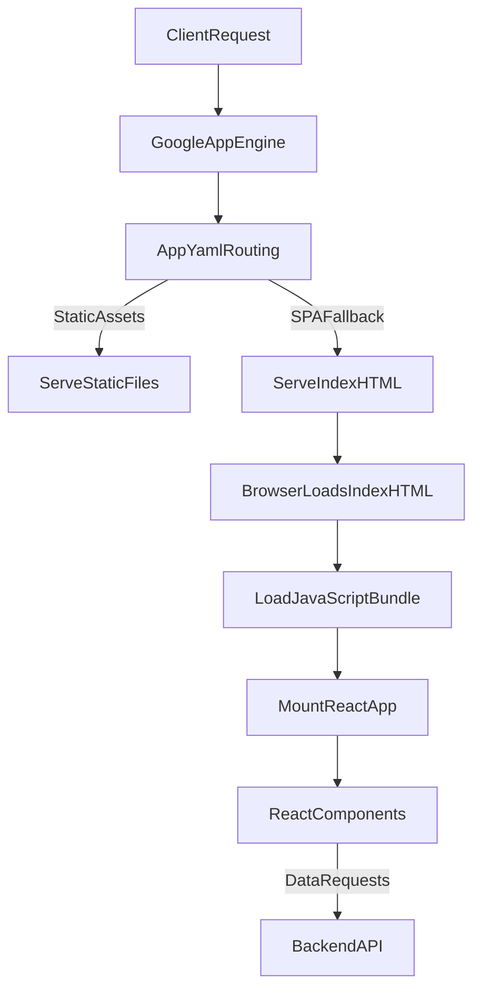

# maxify_frontend — Repository Overview

### High-Level Purpose
This repository hosts the frontend component of the Maxify application. Its primary objective is to deliver a modern, client-side web application, built as a Single-Page Application (SPA), to users via Google App Engine. It handles user interface rendering, client-side routing, user authentication flows (e.g., password reset), and serves as the interactive presentation layer for the overall system. The application also integrates Progressive Web App (PWA) features for an enhanced user experience.

### Architectural Structure
The architecture is structured around a client-side React application deployed on Google App Engine (GAE).

Major layers include:
*   **Deployment & Serving Layer:** Configured by `app.yaml`, defining how GAE routes incoming requests, serves static assets from a `build` directory, and directs all other requests to the SPA's `index.html`.
*   **Frontend Application Layer:** A React-based SPA, organized into:
    *   **Core Logic:** The main `App` component and its entry point (`src/index.js`).
    *   **Components:** Reusable UI elements (e.g., `src/Components/Header.jsx`).
    *   **Pages:** Top-level components representing distinct views or routes (e.g., `src/Pages/Password.jsx`).
    *   **Assets:** Static resources like images and fonts (`public/`, `src/Assets/`, `src/Fonts/`).
*   **Styling Layer:** Global CSS (`src/index.css`, `src/App.css`) combined with Tailwind CSS for utility-first styling and Ant Design for UI components.
*   **Build & Configuration Layer:** `package.json` manages dependencies and scripts, `tailwind.config.js` customizes styling, and `public/manifest.json` provides PWA metadata.

The application leverages client-side routing, meaning the `index.html` acts as a single entry point, and JavaScript handles navigation within the application.

### Core Components
*   **Google App Engine (GAE) `default` service:** The deployment environment, configured via `app.yaml`, responsible for serving the application and routing requests.
*   **`react-scripts`:** The underlying toolchain for building, starting, and testing the React application, originating from Create React App.
*   **React Application:** The primary UI framework, mounted in `public/index.html` by `src/index.js`, comprising components like `Header` and pages like `PasswordPageReset`.
*   **Client-Side Router (`react-router-dom`):** Manages navigation within the SPA without full page reloads.
*   **UI Component Libraries (`antd`, `tailwindcss`):** Provide pre-built UI components and a utility-first CSS framework for consistent styling.
*   **Form Management (`react-hook-form`):** Handles form state, validation, and submission logic.
*   **HTTP Client (`axios`):** Manages API interactions with the backend service.
*   **Web App Manifest (`public/manifest.json`):** Configures PWA features, including home screen installation and display modes.
*   **Web Vitals Reporter (`src/reportWebVitals.js`):** Monitors application performance metrics.

### Interaction & Data Flow
Upon a client request, Google App Engine, configured by `app.yaml`, serves either specific static assets or the `public/index.html` file as the SPA entry point. The browser loads `index.html`, which then initiates the execution of the JavaScript application bundled by `src/index.js`. The React application takes over, mounting its components into the designated `root` DOM element.

User interactions within the React application, such as form submissions (e.g., password reset via `src/Pages/Password.jsx`), trigger asynchronous HTTP requests to a backend API using `axios`. The application manages its local UI state (e.g., loading spinners, dropdown visibility) using React hooks. Authentication-related actions, like "Log Out" in `Header.jsx`, directly manipulate client-side `localStorage`. Global styles from `src/index.css` and `src/App.css`, processed by Tailwind CSS, define the application's visual presentation.

### Technology Stack
*   **Runtime Environment:** Node.js 20 (on Google App Engine), Browser (for client-side execution).
*   **Core Frameworks:** React (with `react-scripts`), Google App Engine.
*   **UI Libraries:** Ant Design (`antd`), Tailwind CSS.
*   **Routing:** `react-router-dom`.
*   **State/Form Management:** `react-hook-form`.
*   **HTTP Client:** `axios`.
*   **Authentication Utilities:** `jwt-decode`.
*   **Notifications:** `react-toastify`.
*   **Performance Monitoring:** `web-vitals`.
*   **Build Tools:** npm/Yarn, PostCSS (for Tailwind CSS), ESLint (for code quality).
*   **Deployment:** Google App Engine.

### Design Observations
The repository implements a standard Single-Page Application (SPA) architecture, leveraging `create-react-app` utilities (`react-scripts`) for quick setup and abstracted build configurations. The `app.yaml` configuration is crucial for efficient static asset serving and SPA routing on Google App Engine, routing all unhandled paths to `index.html`.

Styling combines a component library (`antd`) with a utility-first framework (`tailwindcss`), suggesting a flexible approach to UI development. Consistent `z-index` management and the use of `!important` in `App.css` indicate a deliberate strategy for layering and overriding styles. The inclusion of `manifest.json` highlights a commitment to Progressive Web App (PWA) features for an installable, app-like experience. Performance monitoring is integrated via `web-vitals`.

Logout functionality directly clears `localStorage` without explicit server-side session invalidation. Hardcoded routes and an API constant are present, common in initial project phases. There is evidence of commented-out or inactive code, particularly in `Password.jsx`, suggesting evolving or incomplete feature implementations.

### System Diagram

```mermaid
graph TD
ClientRequest[ClientRequest] --> GoogleAppEngine[GoogleAppEngine]
GoogleAppEngine --> AppYamlRouting[AppYamlRouting]
AppYamlRouting -- StaticAssets --> ServeStaticFiles[ServeStaticFiles]
AppYamlRouting -- SPAFallback --> ServeIndexHTML[ServeIndexHTML]
ServeIndexHTML --> BrowserLoadsIndexHTML[BrowserLoadsIndexHTML]
BrowserLoadsIndexHTML --> LoadJavaScriptBundle[LoadJavaScriptBundle]
LoadJavaScriptBundle --> MountReactApp[MountReactApp]
MountReactApp --> ReactComponents[ReactComponents]
ReactComponents -- DataRequests --> BackendAPI[BackendAPI]
```