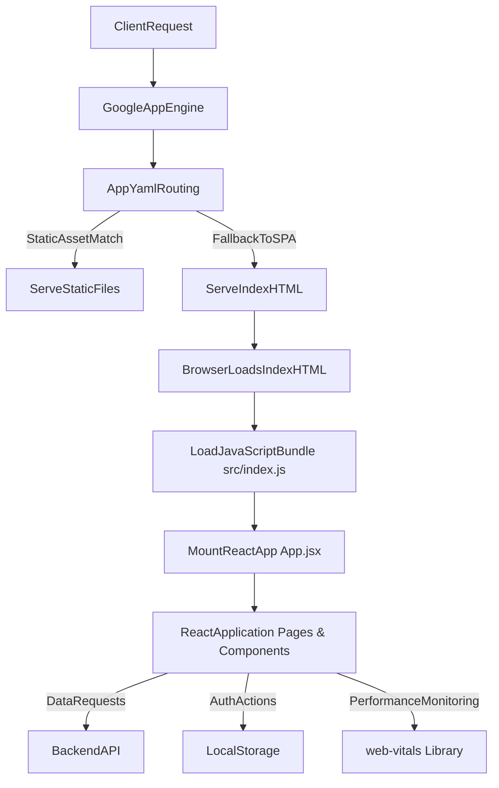

# maxify_frontend — Repository Overview

### High-Level Purpose
The `maxify_frontend` repository provides the client-side Single-Page Application (SPA) for the Maxify platform. Its primary objective is to render the user interface, manage client-side navigation and authentication features (e.g., password resets), and integrate Progressive Web App (PWA) capabilities. It functions as the interactive presentation layer, hosted via Google App Engine.

### Architectural Structure
The repository implements a React-based Single-Page Application (SPA) designed for deployment on Google App Engine (GAE) with a Node.js 20 runtime.
*   **Deployment & Serving**: The `app.yaml` file configures GAE to serve static assets from the `build` directory and to direct all client-side routes to `public/index.html`, enabling SPA routing.
*   **Application Entry**: `src/index.js` bootstraps the React application, mounting the root `src/App.jsx` component into the DOM.
*   **Client-Side Routing**: `App.jsx` utilizes `react-router-dom` to manage navigation, rendering various page components located in `src/Pages/` and leveraging reusable components from `src/Components/`.
*   **Styling**: The application adopts a hybrid styling approach, combining Ant Design (AntD) for UI components, Tailwind CSS for utility-first styling (configured via `tailwind.config.js` and integrated through `src/index.css`), and global/component-specific CSS (`src/App.css`).
*   **Progressive Web App (PWA)**: `public/manifest.json` provides essential metadata for PWA features, enabling an installable, app-like experience.
*   **Build & Dependency Management**: `package.json` defines project metadata, manages dependencies, and specifies `react-scripts` for standard development tasks (start, build, test, eject).

### Core Components
*   **Google App Engine (GAE)**: The cloud platform hosting the frontend, configured by `app.yaml` for serving and routing.
*   **React**: The primary JavaScript library used for building the user interface.
*   **`react-router-dom`**: Manages client-side navigation, allowing dynamic rendering of components based on URL paths.
*   **Ant Design (`antd`) & Tailwind CSS**: UI component library and a utility-first CSS framework, respectively, used for visual styling and consistent UI elements.
*   **`axios`**: The HTTP client used for making asynchronous requests to backend API endpoints.
*   **`react-hook-form`**: Facilitates efficient and robust form management and validation.
*   **`jwt-decode`**: A utility for client-side decoding of JSON Web Tokens, used for authorization checks.
*   **`react-toastify`**: Provides customizable toast notifications for user feedback on operations.
*   **Web App Manifest (`public/manifest.json`)**: Configures the application for PWA features like "Add to Home Screen."
*   **`web-vitals`**: Monitors and reports on key performance metrics affecting user experience, integrated via `src/reportWebVitals.js`.
*   **Layout Components**: `src/Components/Header.jsx` and `src/Components/Footer.jsx` provide consistent application header and footer elements.

### Interaction & Data Flow
1.  **Initial Request**: A user's browser requests the application URL, which Google App Engine intercepts.
2.  **GAE Routing**: The `app.yaml` configuration on GAE routes the request, serving static assets from the `build` directory directly or falling back to `public/index.html` for all client-side routes.
3.  **Client-Side Bootstrap**: The browser loads `index.html`, which then executes the application's JavaScript bundle (initialized by `src/index.js`).
4.  **React Application Mount**: `src/index.js` mounts the root `App` component into the `
` of `index.html`.
5.  **Client-Side Navigation**: `App.jsx`, leveraging `react-router-dom`, manages URL changes and renders the appropriate page component from `src/Pages/`.
6.  **User Interaction & API Calls**: User actions (e.g., form submissions handled by `react-hook-form` in `Admin.jsx` or `Password.jsx`) trigger `axios` HTTP requests to backend API endpoints (configured by the `API` constant in `App.jsx`).
7.  **UI Updates & Feedback**: Responses from the backend APIs trigger React state updates, leading to UI changes such as loading indicators (`Spin`) or `react-toastify` notifications.
8.  **Client-Side Authentication**: Actions like "Log Out" (implemented in `Header.jsx`) involve clearing client-side `localStorage` entries (e.g., `data`) related to user tokens. The `Admin.jsx` component also performs client-side JWT decoding for authorization.
9.  **Performance Monitoring**: `src/reportWebVitals.js` dynamically loads and utilizes the `web-vitals` library to collect and report essential performance metrics, enhancing user experience insights.

### Technology Stack
*   **Runtime Environments**: Node.js 20 (Google App Engine), Web Browser.
*   **Frontend Framework**: React.
*   **Hosting & Deployment**: Google App Engine.
*   **Client-Side Routing**: `react-router-dom`.
*   **UI Libraries**: Ant Design (`antd`), Tailwind CSS.
*   **Form Management & Validation**: `react-hook-form`.
*   **HTTP Client**: `axios`.
*   **Authentication Utilities**: `jwt-decode`.
*   **Notifications**: `react-toastify`.
*   **Performance Monitoring**: `web-vitals`.
*   **Build & Development Tooling**: `react-scripts`, npm/Yarn, PostCSS.

### Design Observations
The project is built on a standard Create React App (CRA) architecture, indicated by `react-scripts` in `package.json`, which streamlines build configurations. The `app.yaml` configuration is critical for efficient static asset serving and robust client-side routing within the Google App Engine environment.

Styling combines Ant Design's comprehensive component library with Tailwind CSS's utility-first approach. The use of `!important` in `src/App.css` for certain rules suggests a need for strong style overrides, which can introduce CSS specificity management challenges. Explicit `z-index` values denote a deliberate layering strategy for complex UI elements like modals or navigation menus.

A clear focus on Progressive Web App (PWA) features is evident through `public/manifest.json`, enabling an installable, app-like user experience with a `standalone` display mode. Performance monitoring is integrated via `web-vitals` to track and report on key user experience metrics.

The logout mechanism directly clears client-side `localStorage`, indicating reliance on client-side token management. The `API` constant in `App.jsx` centralizes backend endpoint configuration, simplifying environment-specific deployments. Unused or commented-out code in `App.jsx`, `Password.jsx`, and `Admin.jsx` (e.g., image imports) suggests evolving features or past iterations. A global `console.log` override in `src/index.js` currently silences all logs unconditionally in what appears to be a production-like setting, which could hinder debugging. Dashboard link storage as JSON strings requires explicit `JSON.parse` and `JSON.stringify` operations on the frontend, establishing a specific data contract with the backend.

### System Diagram

```mermaid
graph TD
ClientRequest[ClientRequest] --> GoogleAppEngine[GoogleAppEngine]
GoogleAppEngine --> AppYamlRouting[AppYamlRouting]
AppYamlRouting -- StaticAssetMatch --> ServeStaticFiles[ServeStaticFiles]
AppYamlRouting -- FallbackToSPA --> ServeIndexHTML[ServeIndexHTML]
ServeIndexHTML --> BrowserLoadsIndexHTML[BrowserLoadsIndexHTML]
BrowserLoadsIndexHTML --> LoadJavaScriptBundle[LoadJavaScriptBundle src/index.js]
LoadJavaScriptBundle --> MountReactApp[MountReactApp App.jsx]
MountReactApp --> ReactApplication[ReactApplication Pages & Components]
ReactApplication -- DataRequests --> BackendAPI[BackendAPI]
ReactApplication -- AuthActions --> LocalStorage[LocalStorage]
ReactApplication -- PerformanceMonitoring --> WebVitalsLibrary[web-vitals Library]
```