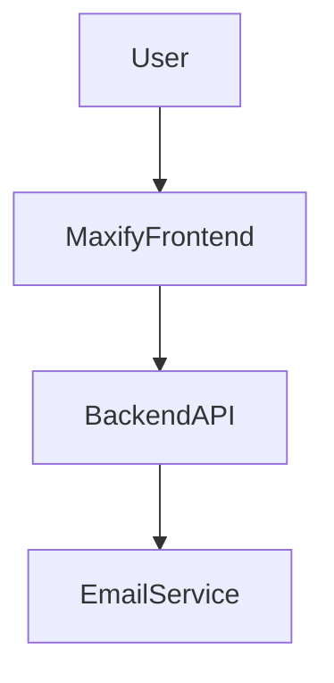

# REPOSITORY_OVERVIEW.md

> **Source File:** [REPOSITORY_OVERVIEW.md](https://github.com/test-company-prowiz/maxify_frontend/blob/develop/REPOSITORY_OVERVIEW.md)
> **Repository:** `maxify_frontend`
> **Branch:** `develop`

# maxify_frontend — Repository Overview

### High-Level Purpose
The `maxify_frontend` repository provides the user interface for an application, primarily focusing on presenting data, handling user interactions, and managing client-side application logic. Based on the `ResetPassword` page functionality, it includes user authentication and account management features.

### Architectural Structure
The frontend is structured as a Single Page Application (SPA) built with React.
*   **`src/Pages`**: Contains top-level components that represent distinct application views or pages.
*   **Component-Based**: The user interface is composed of reusable React components.
*   **Client-Side Routing**: `react-router-dom` manages navigation between different application routes.
*   **API Interaction**: The application directly communicates with a backend API for data retrieval and state manipulation.

### Core Components
*   **Presentation Layer**: React components define the user interface, render data, and handle user input.
*   **Form Management**: `react-hook-form` is utilized for efficient and validated handling of form state and submissions.
*   **Routing**: `react-router-dom` provides declarative routing capabilities, enabling navigation between application pages.
*   **API Client**: `axios` is used to make HTTP requests to the backend API, abstracting away native browser fetch complexities.
*   **Notification System**: `react-toastify` provides a mechanism for displaying transient success or error messages to the user.
*   **UI Library**: `Ant Design` components are integrated to provide a consistent visual language and pre-built UI elements.

### Interaction & Data Flow
The frontend operates as a client, initiating interactions with a backend API.
1.  User interactions (e.g., form submissions, button clicks) trigger client-side events.
2.  These events invoke specific functions that prepare and send HTTP requests via `axios` to defined backend API endpoints (e.g., for password reset initiation).
3.  The frontend processes the responses received from the backend.
4.  Based on the API response, the UI state is updated, which may involve displaying success or error messages, rendering new data, or navigating to a different page using `react-router-dom`.

### Technology Stack
*   **Core Framework**: React
*   **Routing**: `react-router-dom`
*   **Form Management**: `react-hook-form`
*   **HTTP Client**: `axios`
*   **UI Component Library**: `antd` (Ant Design)
*   **Notification Library**: `react-toastify`
*   **Icons**: `@ant-design/icons`

### Design Observations
*   **Streamlined Form Handling**: The use of `react-hook-form` indicates a design choice to manage complex form logic and validation efficiently.
*   **Clear User Feedback**: Integration of `react-toastify` and conditional rendering for loading and success states contributes to a responsive user experience.
*   **Separation of Concerns**: The architecture clearly separates the frontend presentation and logic from backend business logic and data persistence, communicating via a RESTful API.
*   **API Method Convention**: A potential area for review is the use of HTTP GET for operations that initiate state changes on the server, such as sending an email for password reset, which conventionally aligns better with HTTP POST.

### System Diagram

```mermaid
graph TD
User[User] --> MaxifyFrontend[MaxifyFrontend];
MaxifyFrontend --> BackendAPI[BackendAPI];
BackendAPI --> EmailService[EmailService];
```