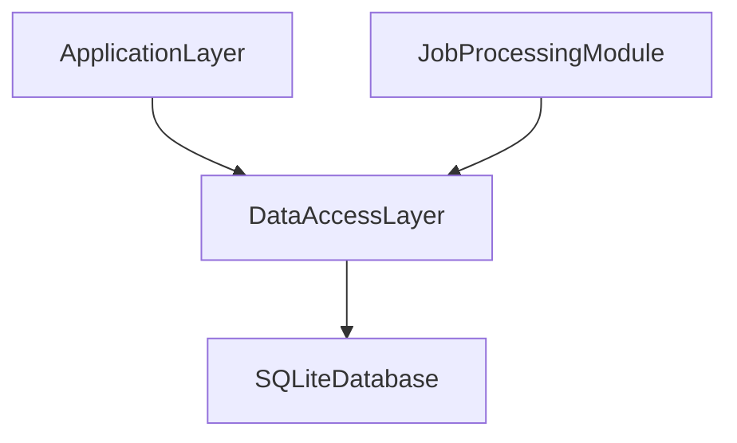

# REPOSITORY_OVERVIEW.md

> **Source File:** [REPOSITORY_OVERVIEW.md](https://github.com/test-company-prowiz/maxify_frontend/blob/main/REPOSITORY_OVERVIEW.md)
> **Repository:** `maxify_frontend`
> **Branch:** `main`

# maxify_frontend — Repository Overview

### High-Level Purpose
The `maxify_frontend` repository appears to host a system primarily focused on automating and managing code documentation generation. Its core objective is to persistently store application settings, orchestrate documentation tasks, track the documentation status of files across different branches, and efficiently manage generated documentation content, likely for consumption by a frontend application.

### Architectural Structure
The repository demonstrates a layered architectural approach, with a dedicated `Components` directory housing core utilities. Specifically, the provided file indicates a strong focus on a robust persistence layer. This layer abstracts direct database interactions, providing a structured API for managing application state and data. It suggests a typical multi-tier structure where application logic interacts with a data access layer, which in turn manages the underlying database.

### Core Components
The primary subsystems and responsibilities inferred are:
-   **Persistence Layer**: Manages an SQLite database (`app_settings.db`) for all application data.
-   **Data Access Object (DAO)**: Provides CRUD operations and schema management for:
    -   Application settings, including versioning and an in-memory cache.
    -   A job queue for documentation tasks, with atomic processing and self-healing capabilities.
    -   Tracking of documented files, specifically designed to be branch-aware.
    -   A content-addressable cache for documentation blobs, facilitating content deduplication.
    -   Repository execution metadata, monitoring the status of documentation runs.
-   **Job Processing Mechanism**: Implied by the presence of a job queue, suggesting a background worker or service that fetches and processes documentation jobs.

### Interaction & Data Flow
Application components (e.g., API endpoints, background workers) interact with the Data Access Layer to:
1.  Store and retrieve application settings, potentially leveraging an in-memory cache.
2.  Enqueue new documentation jobs for repositories and branches.
3.  Atomically fetch and claim pending jobs for processing.
4.  Record the documentation status of individual files, associating them with content-addressable SHAs.
5.  Save and retrieve generated documentation content blobs.
6.  Update the status and outcomes of repository-wide documentation executions.
Data flows primarily between the application logic and the SQLite database, mediated by the Data Access Layer.

### Technology Stack
-   **Database**: SQLite3
-   **Programming Language**: Python (inferred from `.py` extension and module usage)
-   **Data Serialization**: `json`
-   **Standard Libraries**: `time`, `logging`, `datetime`, `typing`
-   **Internal Dependencies**: `prompt_templates.get_full_system_prompt` (suggests integration with AI/LLM for prompt management)

### Design Observations
-   **Robust Data Management**: Utilizes SQLite with Write-Ahead Logging (WAL) for enhanced concurrency and performance, essential for potentially multi-threaded access.
-   **Idempotent Schema Migrations**: Ensures database schema consistency and resilience during initialization or updates.
-   **Branch-Awareness**: Explicitly supports distinct data management for different branches within a repository for both job queues and documented files, crucial for Git-based workflows.
-   **Content Deduplication**: Employs content-addressable `blob_sha` for storing documentation, minimizing redundant AI processing and storage when identical file content is documented across branches or repositories.
-   **Settings Versioning and Caching**: Provides an audit trail for configuration changes and improves read performance through an in-memory cache.
-   **Resilient Job Processing**: Implements atomic job claiming and self-healing mechanisms for stuck or stale jobs, enhancing system reliability in the face of failures.

### System Diagram

```mermaid
graph TD
ApplicationLayer --> DataAccessLayer[DataAccessLayer]
JobProcessingModule --> DataAccessLayer
DataAccessLayer --> PersistenceLayer[SQLiteDatabase]
```