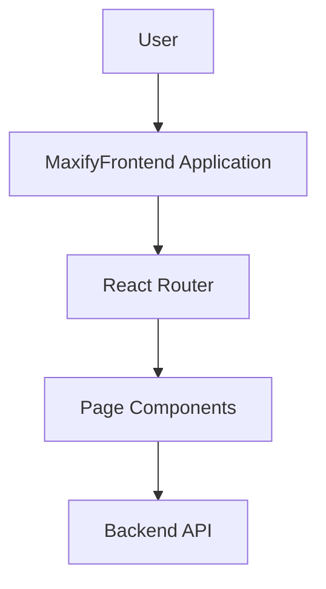

# maxify_frontend — Repository Overview

### High-Level Purpose
This repository hosts the frontend web application for the Maxify system. Its primary objective is to provide a user interface for managing and displaying data, including dashboards, administrative functions, and user authentication workflows (login, password reset).

### Architectural Structure
The repository implements a client-side Single Page Application (SPA) architecture using React. The core structure is organized around a central routing mechanism, with distinct page components residing in a dedicated `Pages` directory. The `App.jsx` file serves as the application's root, orchestrating routing and overall application layout.

### Core Components
-   **`App` Component**: The root React component responsible for application initialization and global routing.
-   **`react-router-dom`**: Provides the declarative routing infrastructure (`BrowserRouter`, `Routes`, `Route`) to navigate between different application views.
-   **Page Components**: Individual React components (e.g., `Login`, `Dashboards`, `Admin`, `Home`) that represent specific views or functionalities within the application.
-   **`API` Constant**: A globally available constant defining the base URL for backend API interactions.

### Interaction & Data Flow
Upon loading, the browser renders the `App` component, which initializes client-side routing. User navigation triggers the `react-router-dom` system to match the current URL path with a defined `Route`, subsequently rendering the corresponding page component. These page components are expected to interact with a backend API to fetch and submit data, utilizing the `API` base URL for request construction.

### Technology Stack
-   **React**: Core JavaScript library for building user interfaces.
-   **`react-router-dom`**: Library for declarative client-side routing in React applications.
-   **CSS**: For styling the application components.

### Design Observations
-   Client-side routing is centrally managed in `App.jsx`, providing a clear overview of application paths.
-   The API base URL is hardcoded, which could be improved by using environment variables for better flexibility across deployment environments.
-   There are opportunities for code cleanup, such as removing unused imports and resolving redundant component imports/aliasing.
-   The application defaults to a login page for the root path, indicating an authentication-gated system.

### System Diagram

```mermaid
graph TD
User --> MaxifyFrontendApplication[MaxifyFrontend Application]
MaxifyFrontendApplication --> BrowserRouter[React Router]
BrowserRouter --> PageComponents[Page Components]
PageComponents --> BackendAPI[Backend API]
```