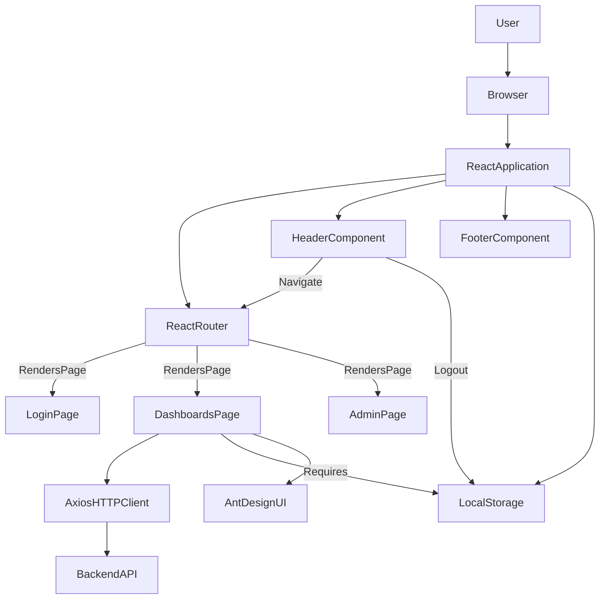

# maxify_frontend — Repository Overview

### High-Level Purpose
The `maxify_frontend` repository provides the client-side user interface for a client portal associated with Maxify Limited. Its primary objective is to offer a consistent user experience, facilitate navigation, manage user sessions, and display application content, primarily focusing on user dashboards.

### Architectural Structure
The repository employs a component-based frontend architecture built with React. UI components are modularized, with reusable elements in `src/Components` and distinct application views as page components in `src/Pages`. Client-side routing, managed by `react-router-dom`, dictates which page component renders based on the URL. Global styling is managed through a central `App.css` file.

### Core Components
*   **Root `App` Component (`App.jsx`)**: Acts as the main entry point, configuring global API endpoints and orchestrating client-side routing.
*   **`Header` Component**: Provides global navigation, branding, "My Account" access, and client-side logout functionality (clearing `localStorage`).
*   **`Footer` Component**: Renders a consistent application footer for branding and copyright information.
*   **Page Components (e.g., `Login`, `Dashboards`, `ResetPassword`, `Home`, `Admin`, `Dash`, `PasswordPageReset`)**: These components represent distinct views, handling specific user interactions and data presentation.
*   **`Dashboards` Component**: A key page component responsible for fetching and displaying user-specific dashboards, managing loading states, and enforcing session-based access.
*   **React Router**: Manages client-side navigation between different application views.
*   **Global Styles (`App.css`)**: Defines foundational typography, error indicators, z-index management, and layout styles for common UI elements.

### Interaction & Data Flow
User interaction primarily drives client-side routing, often initiated via the `Header` component. Navigation actions (e.g., clicking a logo, menu item) trigger `react-router-dom` to render the appropriate page component. For pages like `Dashboards`, user data from `localStorage` is used for authentication checks before making API requests to a backend. Data fetched from the API is then displayed within the relevant page component, with loading states managed by UI components like Ant Design's `Skeleton`. Logout actions clear specific session data from `localStorage`.

### Technology Stack
*   **React**: Core JavaScript library for building user interfaces.
*   **react-router-dom**: For declarative client-side routing.
*   **Tailwind CSS**: Utilized for utility-first styling of components.
*   **Axios**: HTTP client for making API requests to the backend.
*   **Ant Design (antd)**: UI library providing components like `Skeleton` and `Spin` for loading feedback and general UI elements.
*   **JavaScript (ES6+)**: Primary programming language.

### Design Observations
The repository leverages a component-driven design to promote UI reusability, evident in the `Header` and `Footer` components. Styling is primarily handled with Tailwind CSS, which allows for localized styling within JSX, though global styles are also present in `App.css`, sometimes using `!important` to override. Client-side session management relies on `localStorage` for storing user data, which simplifies state management but necessitates careful security considerations. Loading states are well-handled using Ant Design `Skeleton` components, enhancing user experience. Fixed dimensions and specific `z-index` values in global CSS may require careful management for responsive design and UI layering.

### System Diagram

```mermaid
graph TD
User[User] --> Browser[Browser];
Browser --> ReactApp[ReactApplication];

ReactApp --> Router[ReactRouter];
ReactApp --> Header[HeaderComponent];
ReactApp --> Footer[FooterComponent];
ReactApp --> LocalStorage[LocalStorage];

Header -- Navigate --> Router;
Header -- Logout --> LocalStorage;

Router -- RendersPage --> PageLogin[LoginPage];
Router -- RendersPage --> PageDashboards[DashboardsPage];
Router -- RendersPage --> PageAdmin[AdminPage];

PageDashboards --> Axios[AxiosHTTPClient];
PageDashboards -- Requires --> LocalStorage;
Axios --> BackendAPI[BackendAPI];

PageDashboards --> AntDesign[AntDesignUI];
```