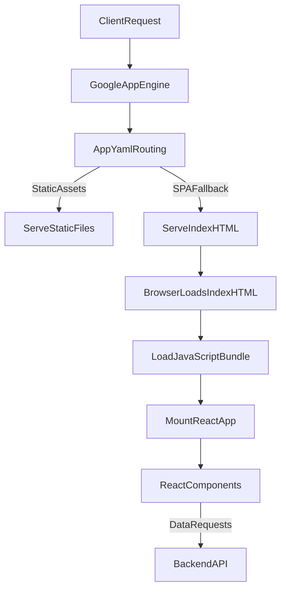

# maxify_frontend — Repository Overview

### High-Level Purpose
The `maxify_frontend` repository provides the client-side Single-Page Application (SPA) for the Maxify platform, delivered via Google App Engine. Its primary objective is to render the user interface, manage client-side navigation, handle user authentication features like password resets, and integrate Progressive Web App (PWA) capabilities for an enhanced user experience. It serves as the interactive presentation layer for the overall Maxify system.

### Architectural Structure
The repository implements a React-based Single-Page Application (SPA) hosted on Google App Engine (GAE) with a Node.js 20 runtime.

*   **Deployment Layer**: `app.yaml` configures GAE to serve static assets from a `build` directory and directs all client-side routes to the `public/index.html` entry point, ensuring robust SPA routing.
*   **Application Layer**: A Create React App (CRA) scaffolding forms the core. `src/index.js` bootstraps the React application, mounting the root `src/App.jsx` component. `App.jsx` utilizes `react-router-dom` for client-side routing, dynamically rendering page components from the `src/Pages` directory and reusable components from `src/Components`.
*   **Styling Layer**: A hybrid approach combines Ant Design (AntD) for comprehensive UI components, Tailwind CSS for utility-first styling (configured via `tailwind.config.js`, integrated via `src/index.css`), and additional global/component-specific CSS in `src/App.css`.
*   **PWA Layer**: `public/manifest.json` provides metadata for Progressive Web App features, enabling "Add to Home Screen" functionality and defining app presentation.
*   **Build & Dependency Management**: `package.json` defines project metadata, scripts (`react-scripts` for build/dev), and manages runtime and development dependencies.

### Core Components
*   **Google App Engine (GAE)**: The cloud platform responsible for hosting and serving the frontend application, configured by `app.yaml`.
*   **React**: The primary JavaScript library for building the user interface, central to the SPA architecture.
*   **`react-router-dom`**: Manages client-side navigation, allowing for seamless transitions between different views without full page reloads.
*   **`react-scripts`**: The foundational tooling provided by Create React App, handling development server, build processes, and testing.
*   **Ant Design (`antd`)**: A comprehensive UI component library used to accelerate UI development and provide a consistent design language.
*   **Tailwind CSS**: A utility-first CSS framework employed for granular styling control and customization.
*   **`axios`**: The HTTP client used for making asynchronous requests to backend APIs.
*   **`react-hook-form`**: Facilitates robust form management, including validation and state handling.
*   **`jwt-decode`**: A utility for client-side decoding of JSON Web Tokens, likely used for extracting user information or token expiry.
*   **`react-toastify`**: Provides user feedback through customizable toast notifications for operations like success or error messages.
*   **Web App Manifest (`public/manifest.json`)**: Configures Progressive Web App (PWA) features, enabling the application to be installed and behave like a native app.
*   **`web-vitals`**: Integrated via `src/reportWebVitals.js` for monitoring and reporting on key performance metrics affecting user experience.

### Interaction & Data Flow
1.  **Initial Request**: A user's browser sends a request, which is intercepted by Google App Engine.
2.  **GAE Routing**: `app.yaml` on GAE routes requests:
    *   Directly serves static assets (CSS, JS bundles, images) from the `build` directory for specific paths.
    *   For all other paths (client-side routes), it serves `public/index.html`.
3.  **Client-Side Bootstrap**: The browser loads `index.html`, which then executes the JavaScript bundle (`src/index.js`).
4.  **React Application Mount**: `src/index.js` mounts the root `App` component into the `div id="root"` within `index.html`.
5.  **Client-Side Routing**: `App.jsx`, utilizing `react-router-dom`, takes control of URL changes, rendering the appropriate page component (`src/Pages/`) based on the current route.
6.  **User Interaction & API Calls**: User actions (e.g., form submissions in `Password.jsx`) are managed by `react-hook-form`. Upon submission, `axios` makes asynchronous HTTP requests to backend API endpoints (defined by the `API` constant in `App.jsx`).
7.  **Data Processing & UI Update**: Responses from the backend trigger state updates in React components, leading to UI changes (e.g., loading spinners, `react-toastify` notifications).
8.  **Client-Side Authentication**: Authentication-related actions, such as "Log Out" in `Header.jsx`, directly manipulate client-side storage (`localStorage`) to clear user data or tokens.
9.  **Performance Monitoring**: `src/reportWebVitals.js` dynamically loads `web-vitals` to collect and report performance metrics during user interaction.

### Technology Stack
*   **Runtime Environments**: Node.js 20 (on Google App Engine for serving), Web Browser (for client-side execution).
*   **Frontend Framework**: React for building the user interface.
*   **Hosting & Deployment**: Google App Engine (GAE).
*   **Routing**: `react-router-dom` for client-side navigation.
*   **UI Libraries**: Ant Design (`antd`) for pre-built components and Tailwind CSS for utility-first styling.
*   **Form Management & Validation**: `react-hook-form`.
*   **HTTP Client**: `axios` for asynchronous API communication.
*   **Authentication Utilities**: `jwt-decode` for parsing JSON Web Tokens.
*   **Notifications**: `react-toastify` for user feedback.
*   **Performance Monitoring**: `web-vitals` to track Core Web Vitals.
*   **Build & Development Tooling**: `react-scripts` (from Create React App), npm/Yarn for package management, and PostCSS for CSS processing (especially Tailwind).

### Design Observations
The repository adopts a standard Create React App (CRA) architecture, leveraging `react-scripts` for streamlined development and build processes. The `app.yaml` configuration is a critical design point for efficient static asset serving and robust client-side routing on Google App Engine, ensuring that all non-static paths fallback to `index.html`.

Styling employs a hybrid strategy, combining the rich component library of Ant Design with the utility-first flexibility of Tailwind CSS. However, the frequent use of `!important` in `src/App.css` for certain rules (e.g., error outlines, z-index) suggests a need for strong overrides, which can introduce CSS specificity challenges. Explicit `z-index` management (e.g., `.profile`, `.no-profile`) indicates a deliberate layering strategy for UI elements.

A clear focus on Progressive Web App (PWA) features is evident through the `public/manifest.json`, enabling an installable, app-like user experience with a `standalone` display mode. Performance is also a consideration, with `web-vitals` integrated for monitoring Core Web Vitals.

The logout mechanism directly clears `localStorage` on the client (`Header.jsx`), indicating a reliance on client-side token expiration rather than explicit server-side session invalidation. The presence of hardcoded API endpoints and routes (e.g., the `API` constant in `App.jsx`) suggests a straightforward interaction model with a single backend. Unused or commented-out code in components like `Password.jsx` points to potentially incomplete features or evolving design iterations. The global `console.log` override in `src/index.js`, while likely intended for production, currently silences all logs unconditionally, which could impede debugging.

### System Diagram

```mermaid
graph TD
ClientRequest[ClientRequest] --> GoogleAppEngine[GoogleAppEngine]
GoogleAppEngine --> AppYamlRouting[AppYamlRouting]
AppYamlRouting -- StaticAssets --> ServeStaticFiles[ServeStaticFiles]
AppYamlRouting -- SPAFallback --> ServeIndexHTML[ServeIndexHTML]
ServeIndexHTML --> BrowserLoadsIndexHTML[BrowserLoadsIndexHTML]
BrowserLoadsIndexHTML --> LoadJavaScriptBundle[LoadJavaScriptBundle]
LoadJavaScriptBundle --> MountReactApp[MountReactApp]
MountReactApp --> ReactComponents[ReactComponents]
ReactComponents -- DataRequests --> BackendAPI[BackendAPI]
```