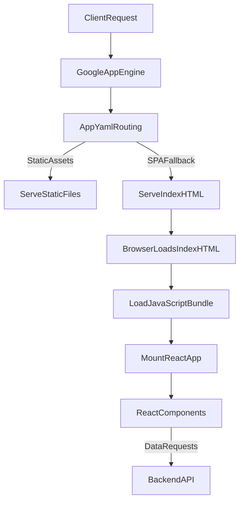

# maxify_frontend — Repository Overview

### High-Level Purpose
The `maxify_frontend` repository provides the client-side Single-Page Application (SPA) for the Maxify platform. Its primary objective is to render the user interface, manage client-side navigation, handle user authentication features like password resets, and integrate Progressive Web App (PWA) capabilities. It serves as the interactive presentation layer, hosted via Google App Engine.

### Architectural Structure
The repository implements a React-based Single-Page Application (SPA) utilizing a Node.js 20 runtime on Google App Engine (GAE).

*   **Deployment**: `app.yaml` configures GAE to serve static assets from the `build` directory and directs all client-side routes to `public/index.html` for SPA routing.
*   **Application**: A Create React App (CRA) scaffolding forms the core. `src/index.js` bootstraps the React application by mounting the root `src/App.jsx` component. `App.jsx` uses `react-router-dom` for client-side routing, rendering page components from `src/Pages` and reusable components from `src/Components`.
*   **Styling**: A hybrid approach combines Ant Design (AntD) for UI components, Tailwind CSS for utility-first styling (configured via `tailwind.config.js`, integrated via `src/index.css`), and global/component-specific CSS (`src/App.css`).
*   **PWA**: `public/manifest.json` provides metadata for Progressive Web App features.
*   **Build & Dependency Management**: `package.json` defines project metadata, scripts (`react-scripts`), and manages dependencies.

### Core Components
*   **Google App Engine (GAE)**: Cloud platform hosting the frontend, configured by `app.yaml`.
*   **React**: Primary JavaScript library for building the user interface.
*   **`react-router-dom`**: Manages client-side navigation within the SPA.
*   **Ant Design (`antd`) & Tailwind CSS**: Provide comprehensive UI components and utility-first styling.
*   **`axios`**: HTTP client for asynchronous backend API requests.
*   **`react-hook-form`**: Facilitates robust form management and validation.
*   **`jwt-decode`**: Utility for client-side decoding of JSON Web Tokens.
*   **`react-toastify`**: Provides user feedback via toast notifications.
*   **Web App Manifest (`public/manifest.json`)**: Configures PWA features like "Add to Home Screen."
*   **`web-vitals`**: Monitors and reports on key performance metrics affecting user experience.

### Interaction & Data Flow
1.  **Initial Access**: A user's browser requests the application, intercepted by Google App Engine.
2.  **GAE Routing**: `app.yaml` on GAE routes requests: serving static assets from the `build` directory or falling back to `public/index.html` for client-side routes.
3.  **Client-Side Bootstrap**: The browser loads `index.html`, which then executes the JavaScript bundle (`src/index.js`).
4.  **React Application Mount**: `src/index.js` mounts the root `App` component into the `div id="root"` within `index.html`.
5.  **Client-Side Routing**: `App.jsx`, using `react-router-dom`, manages URL changes and renders the appropriate page component from `src/Pages/`.
6.  **User Interaction & API Calls**: User actions (e.g., form submissions via `react-hook-form`) trigger `axios` HTTP requests to backend API endpoints (configured by the `API` constant in `App.jsx`).
7.  **UI Updates**: Backend responses trigger React state updates, leading to UI changes such as loading indicators or `react-toastify` notifications.
8.  **Client-Side Authentication**: Actions like "Log Out" (in `Header.jsx`) clear client-side `localStorage` entries (e.g., `data`) for tokens.
9.  **Performance Monitoring**: `src/reportWebVitals.js` dynamically loads `web-vitals` to collect and report performance metrics.

### Technology Stack
*   **Runtime Environments**: Node.js 20 (Google App Engine), Web Browser.
*   **Frontend Framework**: React.
*   **Hosting & Deployment**: Google App Engine.
*   **Routing**: `react-router-dom`.
*   **UI Libraries**: Ant Design (`antd`), Tailwind CSS.
*   **Form Management**: `react-hook-form`.
*   **HTTP Client**: `axios`.
*   **Authentication Utilities**: `jwt-decode`.
*   **Notifications**: `react-toastify`.
*   **Performance Monitoring**: `web-vitals`.
*   **Build & Development**: `react-scripts`, npm/Yarn, PostCSS.

### Design Observations
The project leverages a standard Create React App (CRA) architecture with `react-scripts`, enabling streamlined development. The `app.yaml` configuration is crucial for efficient static asset serving and robust client-side routing on GAE.

Styling combines Ant Design's component library with Tailwind CSS's utility-first approach. The use of `!important` in `src/App.css` for certain rules suggests a need for strong overrides, which can introduce CSS specificity management challenges. Explicit `z-index` values indicate a deliberate layering strategy for UI elements.

A clear focus on Progressive Web App (PWA) features is evident through `public/manifest.json`, enabling an installable, app-like user experience. Performance monitoring is integrated via `web-vitals`.

The logout mechanism directly clears client-side `localStorage`, indicating reliance on client-side token expiration. The `API` constant in `App.jsx` centralizes backend endpoint configuration. Unused or commented-out code in components like `Password.jsx` and `App.jsx` suggests evolving features or past iterations. A global `console.log` override in `src/index.js` currently silences all logs unconditionally, potentially hindering debugging.

### System Diagram

```mermaid
graph TD
ClientRequest[ClientRequest] --> GoogleAppEngine[GoogleAppEngine]
GoogleAppEngine --> AppYamlRouting[AppYamlRouting]
AppYamlRouting -- StaticAssets --> ServeStaticFiles[ServeStaticFiles]
AppYamlRouting -- SPAFallback --> ServeIndexHTML[ServeIndexHTML]
ServeIndexHTML --> BrowserLoadsIndexHTML[BrowserLoadsIndexHTML]
BrowserLoadsIndexHTML --> LoadJavaScriptBundle[LoadJavaScriptBundle]
LoadJavaScriptBundle --> MountReactApp[MountReactApp]
MountReactApp --> ReactComponents[ReactComponents]
ReactComponents -- DataRequests --> BackendAPI[BackendAPI]
```