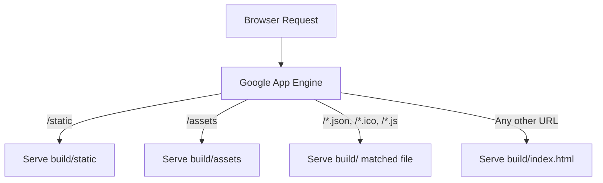

# app.yaml

### Overview
This file configures the deployment and serving behavior of a Google App Engine (GAE) standard environment application. It defines the service name, runtime environment, and a series of URL handlers to direct incoming requests to static files or directories.

### Architecture & Role
Architecturally, `app.yaml` acts as a deployment descriptor and routing configuration layer for the `default` App Engine service. It sits at the infrastructure configuration level, instructing the GAE platform on how to host and serve the application's static assets and main entry point. It specifies a Node.js 20 runtime for the application environment.

### Key Components
*   **`service: default`**: Designates this configuration for the primary service within the App Engine application.
*   **`runtime: nodejs20`**: Specifies that the application requires a Node.js 20 runtime environment.
*   **`handlers`**: An ordered list of URL patterns and the actions GAE should take when a request matches a pattern.
    *   **`static_dir`**: Directs requests matching a URL pattern to a specific directory containing static files (e.g., `/static`, `/assets`).
    *   **`static_files`**: Directs requests matching a URL pattern to a single static file or a specific set of files, often used with regular expressions for file types.
    *   **`upload`**: A regular expression that specifies which files in the local directory should be uploaded to App Engine for this handler.

### Execution Flow / Behavior
When a request arrives at the App Engine application:
1.  GAE evaluates the request URL against the `handlers` list in sequential order.
2.  If the URL starts with `/static`, files are served directly from the `build/static` directory.
3.  If the URL starts with `/assets`, files are served directly from the `build/assets` directory.
4.  If the URL ends with `.json`, `.ico`, or `.js`, the corresponding file is served from the `build` directory.
5.  For any other URL that has not been matched by preceding handlers, the `build/index.html` file is served. This catch-all handler is typical for single-page applications (SPAs) to allow client-side routing.

### Dependencies
*   **`build` directory**: The configuration implicitly depends on the presence of a `build` directory containing compiled static assets, including `static/`, `assets/`, `index.html`, and various `.json`, `.ico`, and `.js` files. This directory is typically generated by a build process (e.g., Webpack, Vite, Create React App).
*   **Node.js 20 Runtime**: The application code is expected to be compatible with and run within the Node.js 20 environment provided by GAE.

### Design Notes
This configuration is specifically designed for deploying a client-side rendered Single-Page Application (SPA) on Google App Engine. The ordered `handlers` ensure that static assets (CSS, JS, images, favicons, manifest files) are served directly and efficiently, while all other routes default to `index.html`, allowing the client-side router to take over. This approach offloads routing logic from the server for most user interactions, improving performance and simplifying server-side setup.

### Diagram
