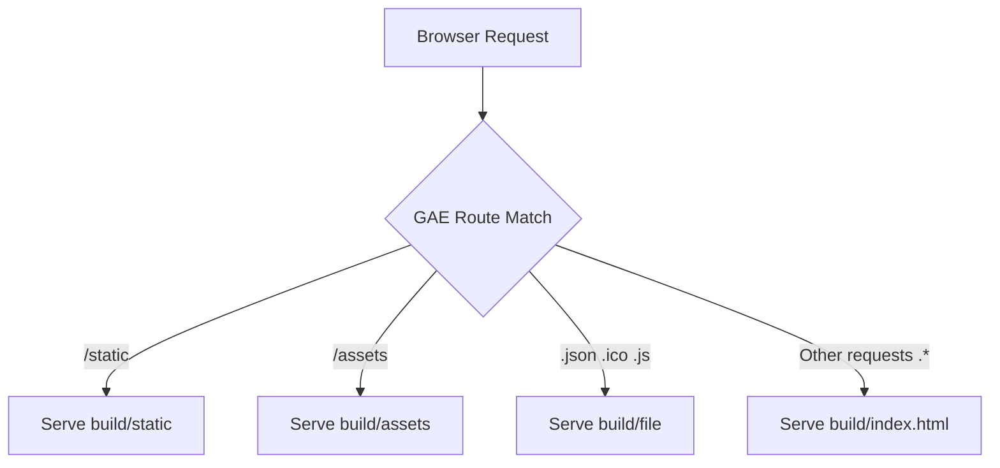

# app.yaml

### Overview
This file serves as the configuration for deploying a Google App Engine (GAE) service, specifically the `default` service for a Node.js application. It defines how incoming HTTP requests are routed and handled, primarily for serving static assets and a single-page application's main HTML file.

### Architecture & Role
Architecturally, `app.yaml` is a deployment descriptor that sits at the infrastructure configuration layer. Its role is to instruct the Google App Engine runtime environment on how to deploy and serve the application's artifacts. It governs the URL routing logic, determining which files are served for various request paths, thereby acting as the entry point configuration for the deployed service.

### Key Components
*   **`service: default`**: Designates this as the primary service in the App Engine application.
*   **`runtime: nodejs20`**: Specifies that the application should run on the Node.js 20 standard environment.
*   **`handlers`**: A list of URL patterns and the corresponding actions App Engine should take.
    *   **`/static`**: Maps requests for `/static` paths to serve files from the `build/static` directory.
    *   **`/assets`**: Maps requests for `/assets` paths to serve files from the `build/assets` directory.
    *   **`/(.*\.(json|ico|js))$`**: Matches requests for `.json`, `.ico`, or `.js` files and serves them directly from the `build` directory, using a regex capture group.
    *   **`.*`**: A catch-all handler that serves `build/index.html` for any request not matched by the preceding rules.

### Execution Flow / Behavior
When a request arrives at the App Engine service, it sequentially evaluates the `handlers` defined in this configuration.
1.  Requests starting with `/static` are routed to the `build/static` directory.
2.  Requests starting with `/assets` are routed to the `build/assets` directory.
3.  Requests ending in `.json`, `.ico`, or `.js` are served directly from the `build` directory.
4.  Any other request that does not match the previous patterns is served the `build/index.html` file. This pattern supports client-side routing for single-page applications.

### Dependencies
*   **Internal**: This configuration implicitly depends on a `build` directory existing in the deployment package, containing compiled static assets (CSS, JS, images), specific build output files (JSON, ICO, JS), and the main `index.html` file.
*   **External**: The file depends on the Google App Engine platform for interpretation and execution, specifically the `nodejs20` runtime environment.

### Design Notes
This `app.yaml` configuration is designed to efficiently serve a single-page application (SPA). By prioritizing specific static asset directories and individual build files, it optimizes content delivery. The `.*` catch-all handler serving `index.html` is a common pattern that allows client-side routers to manage application views without requiring server-side route definitions for every possible URL path. This setup leverages App Engine's static file serving capabilities to offload direct file serving from the application code.

### Diagram (Optional)
