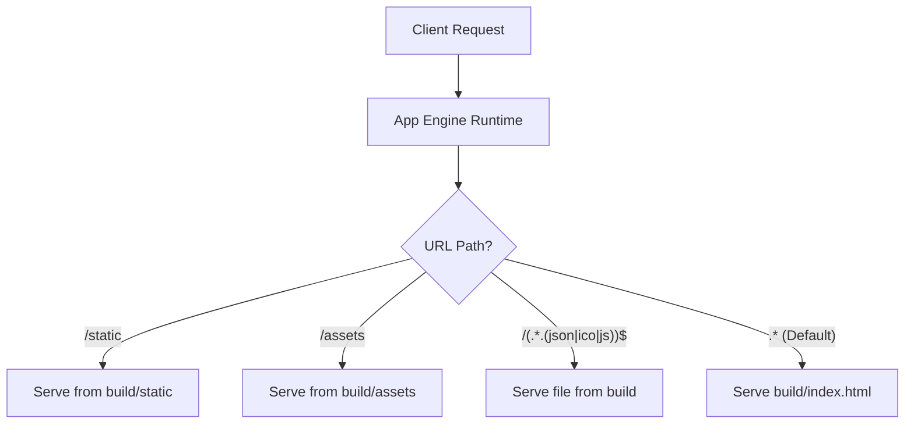

# app.yaml

> **Source File:** [app.yaml](https://github.com/maxify_frontend/blob/main/app.yaml)  
> **Repository:** `maxify_frontend`  
> **Branch:** `main`

### Overview
This `app.yaml` file is a configuration manifest for a Google App Engine (GAE) service. It defines the runtime environment for the application and specifies how incoming HTTP requests are handled, primarily for serving static assets and routing all other requests to a single-page application's `index.html`.

### Architecture & Role
Architecturally, this file operates at the deployment and serving layer within the Google App Engine ecosystem. It configures the `default` service, setting it up to run on the `nodejs20` runtime. Its role is to act as a front-door router for the application, directing requests for specific static resources to their respective build directories and ensuring that all other client-side routing requests are served by the application's main HTML entry point.

### Key Components
*   **`service: default`**: Designates this configuration for the primary and default service of the App Engine application.
*   **`runtime: nodejs20`**: Specifies that the application should run within a Node.js 20 environment on App Engine.
*   **`handlers`**: An ordered list of URL patterns and the actions App Engine should take when a request matches a pattern.
    *   **`/static`**: Serves content directly from the `build/static` directory.
    *   **`/assets`**: Serves content directly from the `build/assets` directory.
    *   **`/(.*\.(json|ico|js))$`**: A regular expression that matches any URL ending in `.json`, `.ico`, or `.js`. It serves the corresponding file from the `build/` directory and specifies files matching this pattern for upload.
    *   **`.*`**: A catch-all pattern that matches any URL not previously handled. It serves `build/index.html` and specifies this file for upload.

### Execution Flow / Behavior
When a client request reaches the Google App Engine instance configured by this `app.yaml`:
1.  App Engine first checks if the request URL matches `/static`. If it does, content is served from the `build/static` directory.
2.  If not, it checks for `/assets`. If matched, content is served from `build/assets`.
3.  Next, it checks if the URL matches the regular expression `/(.*\.(json|ico|js))$`. If there's a match, the corresponding file (e.g., `build/app.js` for `/app.js`) is served directly from the `build` directory.
4.  Finally, if none of the above patterns match, the `.*` handler is invoked, and `build/index.html` is served. This behavior is typical for Single-Page Applications (SPAs) where client-side routing handles subsequent URL changes.

### Dependencies
*   **Google App Engine (GAE)**: This file is entirely dependent on the GAE platform for interpretation and execution.
*   **Node.js 20 Runtime**: Requires the GAE environment to provide a Node.js 20 runtime.
*   **`build` Directory**: The configuration implicitly depends on a `build` directory existing at the root of the deployed service, containing pre-compiled static assets (HTML, CSS, JavaScript, images, etc.) and specifically `index.html`.

### Design Notes
The handler order is crucial, with more specific patterns (like `/static` or file extensions) appearing before the general catch-all `.*` pattern. This design effectively separates static asset serving from the main application entry point, common for web applications leveraging client-side routing. The `upload` directives ensure that only necessary files are deployed to App Engine, optimizing deployment size.

### Diagram

```mermaid
graph TD
A[Client Request] --> B[App Engine Runtime]
B --> C{URL Path?}
C -- /static --> D[Serve from build/static]
C -- /assets --> E[Serve from build/assets]
C -- /(.*.(json|ico|js))$ --> F[Serve file from build]
C -- .* (Default) --> G[Serve build/index.html]
```