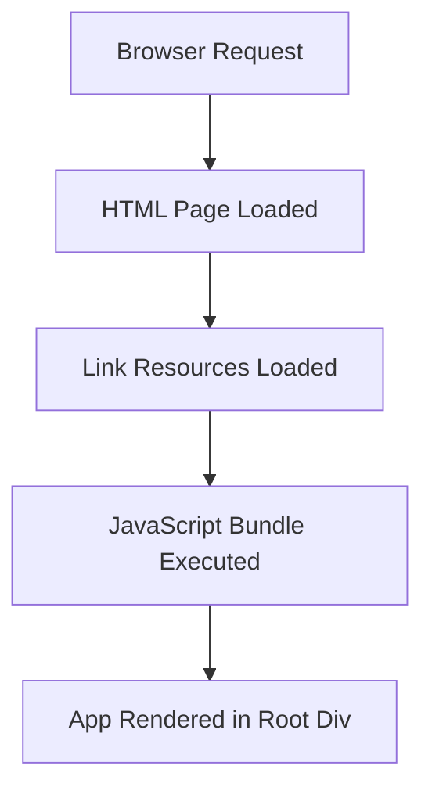

# public/index.html

> **Source File:** [public/index.html](https://github.com/maxify_frontend/blob/main/public/index.html)  
> **Repository:** `maxify_frontend`  
> **Branch:** `main`

### Overview
This file serves as the main entry point and the foundational HTML document for a client-side web application. It defines the initial page structure, metadata, linked resources (like favicons, web app manifest, and external fonts), and provides a mount point for a JavaScript-driven application.

### Architecture & Role
Architecturally, `index.html` resides at the very front of the client-side presentation layer. It is the initial resource retrieved by a web browser when accessing the application's root URL. Its primary role is to act as a container for the dynamically loaded and rendered JavaScript application, typically a Single Page Application (SPA), rather than containing significant static content itself beyond initial loading artifacts.

### Key Components
*   **`
`**: This is the designated DOM element where the client-side JavaScript application (e.g., a React app) will mount and render its entire user interface.
*   **`%PUBLIC_URL%`**: A placeholder string used for referencing assets located in the `public` directory. This is replaced by the actual public URL path during the build process, ensuring correct asset paths regardless of the deployment environment.
*   **`<link rel="manifest" href="%PUBLIC_URL%/manifest.json" />`**: Links to the Web App Manifest, which provides metadata for installing the web application on a user's device.
*   **`<noscript>` tag**: Provides a fallback message if JavaScript is disabled in the user's browser, indicating that the application requires JavaScript to function.

### Execution Flow / Behavior
1.  A web browser requests the application's URL, and the web server responds by serving this `index.html` file.
2.  The browser parses the HTML, identifies and begins loading critical resources such as the favicon, manifest, and external fonts.
3.  During a build process (e.g., `create-react-app`'s `npm run build`), the compiled JavaScript and CSS bundles are injected into the `<body>` of this HTML file.
4.  Once the JavaScript bundle executes, it targets the `
` element and dynamically renders the entire client-side application into it.
5.  If JavaScript is disabled, the content within the `<noscript>` tag is displayed to the user.

### Dependencies
*   **Internal (relative to `%PUBLIC_URL%`)**:
    *   `favicon.ico`: Standard browser icon.
    *   `manifest.json`: Web application manifest file.
*   **External**:
    *   Google Fonts (`https://fonts.googleapis.com`, `https://fonts.gstatic.com`): Used to import the 'Quicksand' font family, indicating a specific typographic design choice.
*   **Implicit (build-time injection)**:
    *   The compiled JavaScript application bundle and its associated CSS, which are injected into the `<body>` by the build toolchain.

### Design Notes
*   The use of `%PUBLIC_URL%` indicates that this file is part of a build system (e.g., `create-react-app`) that performs asset path replacement, allowing for flexible deployment without hardcoding paths.
*   The empty `
` is a standard pattern for Single Page Applications (SPAs), providing a clear container for JavaScript-driven rendering.
*   The included comments highlight that this file is a template and that bundled scripts will be placed into the `<body>` by a build step, reinforcing its role as a dynamic shell rather than a static content page.
*   The `preconnect` link tags for Google Fonts are an optimization to establish early connections, potentially speeding up font loading.

### Diagram (Optional)
