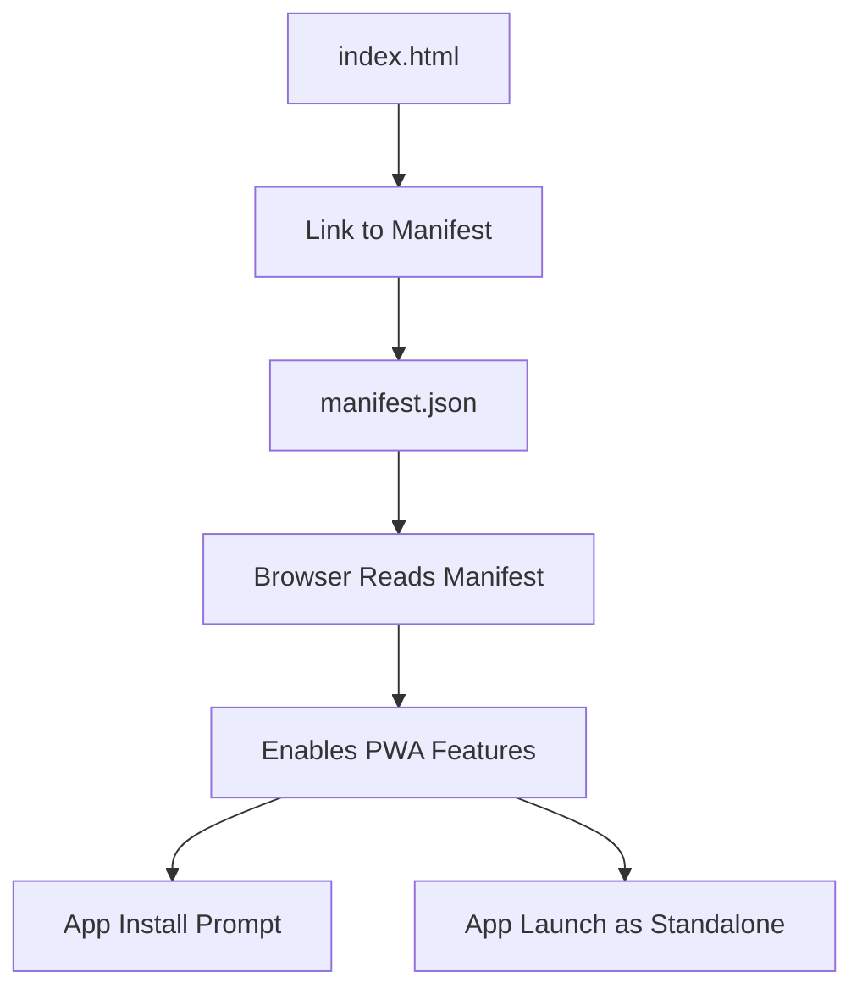

# public/manifest.json

> **Source File:** [public/manifest.json](https://github.com/maxify_frontend/blob/main/public/manifest.json)  
> **Repository:** `maxify_frontend`  
> **Branch:** `main`

### Overview
This file serves as the Web App Manifest for the application. It provides metadata to web browsers and operating systems, enabling the web application to be installed on a user's device and to define its appearance and behavior when launched as an installed application, such as an "Add to Home Screen" shortcut.

### Architecture & Role
Architecturally, this file belongs to the frontend client-side layer. Its role is to describe the web application's identity and presentation characteristics to the browser and the underlying operating system. It is typically referenced by the main `index.html` file using a `<link rel="manifest" href="/manifest.json">` tag, making it discoverable for Progressive Web App (PWA) features.

### Key Components
The file's content is a JSON object with several standard properties:

*   **`short_name`**: A concise name for the application, used in contexts where space is limited (e.g., home screen icons).
*   **`name`**: The full, human-readable name of the application.
*   **`icons`**: An array of objects specifying various icon sources, sizes, and types for the application. These icons are used for splash screens, home screen shortcuts, and app launchers.
*   **`start_url`**: Defines the URL that loads when the application is launched from a home screen icon.
*   **`display`**: Specifies the preferred display mode for the application (e.g., `standalone` to hide browser UI, providing a native app-like experience).
*   **`theme_color`**: Defines the default theme color for the application, which may affect the browser's UI elements like the address bar.
*   **`background_color`**: Specifies the background color that appears on the splash screen while the application is loading.

### Execution Flow / Behavior
When a browser encounters a link to `manifest.json` in the `index.html` file, it fetches and parses this JSON document. The browser then uses the information within the manifest to:

*   Offer installation options (e.g., "Add to Home Screen").
*   Configure the appearance of the installed application's shortcut icon.
*   Determine the initial URL and display mode (`standalone`) when the application is launched as an installed app.
*   Apply specified theme and background colors to relevant UI elements (e.g., splash screen, browser address bar).
The manifest itself does not execute code; it purely provides declarative configuration.

### Dependencies
*   **Internal:** This file is referenced by `public/index.html`. It also references static image assets (`favicon.ico`, `logo192.png`, `logo512.png`) which are expected to be present in the `public` directory.
*   **External:** The structure and interpretation of `manifest.json` adhere to the W3C Web App Manifest specification.

### Design Notes
This manifest file enables the web application to leverage Progressive Web App (PWA) features, allowing users to "install" the application to their device's home screen. The `display: "standalone"` property is a key design choice that provides a more immersive, app-like experience by removing browser chrome. The specified icon sizes ensure appropriate display across various device resolutions, and the theme and background colors provide brand consistency during loading and within system UIs.

### Diagram (Optional)
