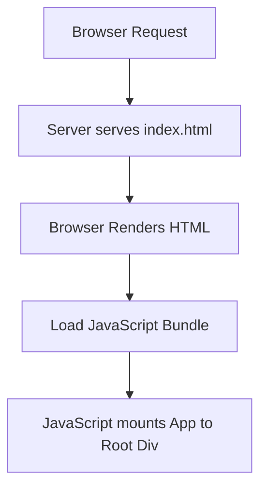

# public/index.html

### Overview
This file serves as the foundational HTML document for a single-page application (SPA). It acts as the initial entry point that a web browser loads, defining the basic page structure, metadata, and linking essential static resources like favicons, web app manifest, and external fonts. It also provides the specific DOM element (`
`) where the client-side JavaScript application will mount and render its user interface.

### Architecture & Role
Architecturally, `index.html` resides at the client-side presentation layer. It is the root HTML document delivered by the web server in response to an initial browser request for the application. Its primary role is to act as a container for the dynamically rendered JavaScript application, rather than containing significant static content itself. It is implicitly part of a build pipeline, typically provided by a framework like Create React App, which injects the compiled JavaScript and CSS bundles into its `<body>` section during the build process.

### Key Components
*   **`<head>` section**: Contains critical metadata, viewport settings, theme color, description, and links to external resources.
    *   `%PUBLIC_URL%`: A placeholder used by the build system to correctly reference assets within the `public` folder, ensuring path correctness regardless of deployment base URL.
    *   `manifest.json`: Links to the web app manifest, which provides metadata for progressive web app (PWA) features.
    *   Google Fonts: Links to `Quicksand` font via `preconnect` and `href` attributes for typography.
*   **`
`**: This is the designated DOM element within the `<body>` where the client-side JavaScript application (e.g., a React application) will programmatically attach and render its components.
*   **`<noscript>` tag**: Provides a fallback message to users if JavaScript is disabled in their browser, indicating that the application requires JavaScript to function.

### Execution Flow / Behavior
When a browser requests the application, the web server delivers this `index.html` file. The browser parses the HTML, loads resources specified in the `<head>` (like stylesheets and the manifest), and displays the basic structure. Subsequently, JavaScript bundles, which are injected into the `<body>` during the build process, execute. These scripts then identify the `
` element and mount the entire client-side application's user interface onto it, effectively hydrating the otherwise empty `<body>` content. If JavaScript is not enabled, the content within the `<noscript>` tag becomes visible.

### Dependencies
*   **`%PUBLIC_URL%/favicon.ico`**: The site's favicon.
*   **`%PUBLIC_URL%/manifest.json`**: Provides web app metadata for installation and display.
*   **Google Fonts**: External CSS files for the 'Quicksand' font family, hosted by Google Fonts.
*   **Client-side JavaScript Application**: This file implicitly depends on a JavaScript application (e.g., a React app) that is built and bundled. The build process injects the compiled JavaScript and CSS assets into this HTML template, which then targets the `
`.

### Design Notes
This file is designed as a template. It is kept minimal and largely static, relying on a build system (indicated by comments referencing `create-react-app`, `npm start`, `npm run build`) to inject dynamic elements like bundled JavaScript and CSS. The `%PUBLIC_URL%` placeholder simplifies asset management, ensuring URLs are correctly resolved during development and production builds. The dedicated `
` adheres to a common SPA pattern for defining the application's mount point.

### Diagram (Optional)
