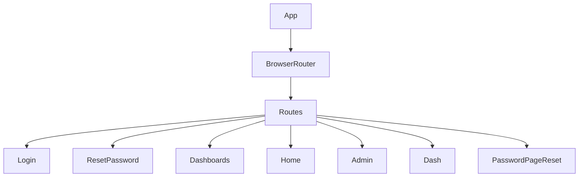

# src/App.jsx

> **Source File:** [src/App.jsx](https://github.com/test-company-prowiz/maxify_frontend/blob/main/src/App.jsx)
> **Repository:** `maxify_frontend`
> **Branch:** `main`

# src/App.jsx

### Overview
This file defines the root component of the React application. Its primary purpose is to configure client-side routing using `react-router-dom` and establish the global API endpoint for backend communication.

### Architecture & Role
This component operates at the top level of the frontend application architecture. It serves as the main entry point for the user interface, responsible for rendering the correct page component based on the current URL path. It acts as the routing orchestrator for the entire client application.

### Key Components
*   **`App` function component**: The main application component that encapsulates the routing logic.
*   **`API` constant**: A string constant holding the base URL for all backend API requests, exported for use across the application.
*   **`BrowserRouter`**: Enables client-side routing by providing a common router context.
*   **`Routes`**: A container component for defining multiple route configurations.
*   **`Route`**: Defines a specific path-to-component mapping.
*   **Page Components**:
    *   `Login`: Handles user authentication.
    *   `ResetPassword`: Manages password reset requests.
    *   `Dashboards`: Displays a collection of dashboards.
    *   `Home`: Represents the application's landing page.
    *   `Admin`: Provides administrative functionalities.
    *   `Dash`: A generic dashboard view.
    *   `PasswordPageReset`: Handles password reset via a token.

### Execution Flow / Behavior
When the `App` component mounts, it initializes the `BrowserRouter`. The `Routes` component then evaluates the current browser URL. Based on the matching `path` attribute of a `Route`, the corresponding `element` (a React page component) is rendered within the `App` component's structure. If no specific path matches, the root path `/` or `/login` will typically render the `Login` page. The `API` constant is available for direct import by other modules requiring the backend service endpoint.

### Dependencies
*   **`react-router-dom`**: Provides core routing capabilities (`BrowserRouter`, `Route`, `Routes`).
*   **`./App.css`**: Imports global styling for the application.
*   **Page components (e.g., `./Pages/Login`, `./Pages/Dashboards`)**: These are individual page-level components rendered by the router.

### Design Notes
The centralized routing configuration within `App.jsx` provides a clear overview of the application's navigation structure. Exporting the `API` constant from this top-level component ensures a single source of truth for the backend service URL, simplifying maintenance. There are unused imports for `KPI` and `Password` components which might indicate legacy code or future development paths. The `Password` component is imported twice under different aliases (`Password` and `PasswordPageReset`), with only `PasswordPageReset` being actively used in a route.

### Diagram
