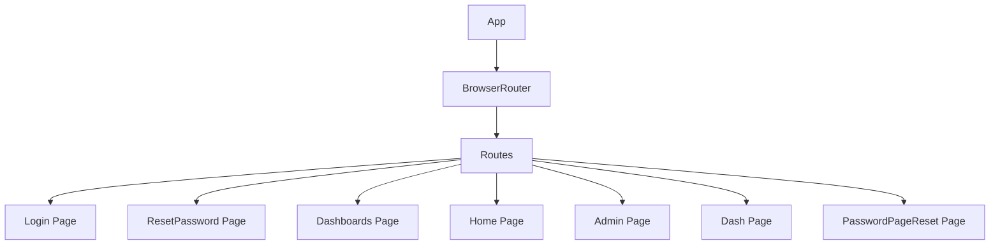

# src/App.jsx

> **Source File:** [src/App.jsx](https://github.com/test-company-prowiz/maxify_frontend/blob/main/src/App.jsx)
> **Repository:** `maxify_frontend`
> **Branch:** `main`

# src/App.jsx

### Overview
This file serves as the root component of the React application, responsible for setting up client-side routing and defining the base URL for API interactions. It orchestrates the rendering of different page components based on the current URL path.

### Architecture & Role
This file resides in the frontend application layer. It functions as the entry point for the user interface, configuring the main routing mechanism. It is a core part of the presentation layer, connecting the application's URL structure to its corresponding views.

### Key Components
- **`App` function component**: The main React component that encapsulates the application's structure and routing logic.
- **`BrowserRouter`**: A React Router component that uses the HTML5 history API to keep the UI in sync with the URL.
- **`Routes`**: A React Router component that groups individual `Route` definitions.
- **`Route`**: Defines a mapping between a URL path and the component to be rendered when that path is active.
- **`API` constant**: Exports the base URL for the backend API, `https://maxify.prowiz.io`.
- **Page Components**: Imports and uses various page components from the `./Pages` directory, including `Login`, `ResetPassword`, `Dashboards`, `Dash`, `Admin`, `Home`, and `PasswordPageReset`.

### Execution Flow / Behavior
When the application loads, the `App` component is rendered. It initializes the `BrowserRouter` to enable declarative navigation. Inside the `BrowserRouter`, a `Routes` component is configured with multiple `Route` elements. Each `Route` specifies a URL path and the corresponding React component to render when that path is matched. For example, navigating to `/login` or `/` will render the `Login` component, while `/dashboards` will render the `Dashboards` component. The `API` constant is available globally for other modules to construct API requests.

### Dependencies
- **`react-router-dom`**: Provides core routing functionalities like `BrowserRouter`, `Route`, and `Routes`.
- **`./App.css`**: Supplies global styles for the application's root `div`.
- **`./Pages/Login`**: The login page component.
- **`./Pages/ResetPassword`**: The initial password reset request page component.
- **`./Pages/Dashboards`**: A page displaying multiple dashboards.
- **`./Pages/Dash`**: A specific dashboard page component.
- **`./Pages/Password`**: Used for the `PasswordPageReset` route, likely handling token-based password resets.
- **`./Pages/Admin`**: The administration panel page component.
- **`./Pages/Home`**: The main home page component.

### Design Notes
- The application's routing is centrally managed within this file, providing a clear overview of all accessible paths.
- The `API` base URL is a hardcoded export. For production environments, it is generally preferable to manage such configurations using environment variables to allow for easier deployment across different stages (development, staging, production).
- The import list contains `KPI` which is not used in any route, and `Password` is imported twice under different aliases (`Password` and `PasswordPageReset`) but points to the same file. This indicates potential cleanup or refactoring opportunities for component naming and import management.
- The root path `/` defaults to the `Login` page, which is a common pattern for applications requiring authentication.

### Diagram
