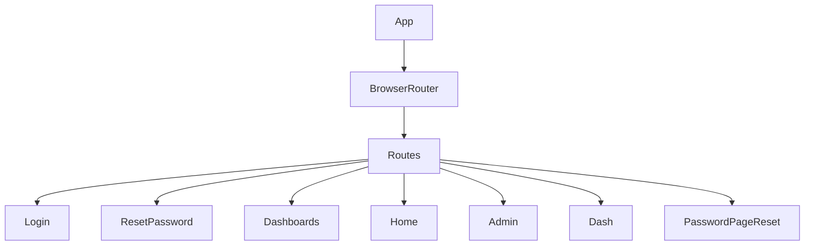

# src/App.jsx

> **Source File:** [src/App.jsx](https://github.com/test-company-prowiz/maxify_frontend/blob/main/src/App.jsx)
> **Repository:** `maxify_frontend`
> **Branch:** `main`

# src/App.jsx

### Overview
This file serves as the main entry point for the client-side React application, primarily responsible for configuring and managing client-side routing using `react-router-dom`. It defines the various routes and their corresponding page components.

### Architecture & Role
This file resides at the application's root level within the frontend architecture. It functions as the top-level orchestrator for client-side navigation, belonging to the presentation layer. It integrates different page components into a cohesive single-page application experience.

### Key Components
*   **`App` Function Component**: The root React component that encapsulates the entire application, including the router and all defined routes.
*   **`BrowserRouter`**: A component from `react-router-dom` that uses the HTML5 history API to keep the UI in sync with the URL.
*   **`Routes`**: A component that groups individual `Route` components. It renders the first `Route` that matches the current URL.
*   **`Route`**: Defines a specific path and the React component to render when that path is active.
*   **`API` Constant**: A globally exported string constant holding the base URI for the backend API (`https://maxify.prowiz.io`).

### Execution Flow / Behavior
When the application initializes, the `App` component renders. The `BrowserRouter` sets up listening for URL changes. Inside `BrowserRouter`, the `Routes` component evaluates the current URL path against its defined `Route` components. Upon a match, the associated page component (e.g., `Login`, `Dashboards`, `Admin`) is rendered within the application's main content area, facilitating navigation without full page reloads.

### Dependencies
*   **`react-router-dom`**: External library providing the core routing functionality (`BrowserRouter`, `Route`, `Routes`).
*   **`./App.css`**: Internal stylesheet for styling the root `App` component.
*   **`./Pages/Login`**: Internal component, rendered for the `/login` and `/` paths.
*   **`./Pages/ResetPassword`**: Internal component, rendered for the `/resetpassword` path.
*   **`./Pages/Dashboards`**: Internal component, rendered for the `/dashboards` path.
*   **`./Pages/Home`**: Internal component, rendered for the `/home` path.
*   **`./Pages/Admin`**: Internal component, rendered for the `/admin` path.
*   **`./Pages/Dash`**: Internal component, rendered for the `/dash` path.
*   **`./Pages/Password`**: Internal component, aliased as `PasswordPageReset`, rendered for the `/resetpassword/:token` path.

### Design Notes
The application employs a centralized routing configuration within the `App.jsx` file. This approach makes it straightforward to inspect all available routes. The `API` constant is exported globally for easy access across the application to the backend endpoint. A potential area for refinement could be the multiple imports from `./Pages/Password` (`Password` and `PasswordPageReset`), which might indicate an opportunity for clearer component naming or aliases if they represent distinct functionalities.

### Diagram
