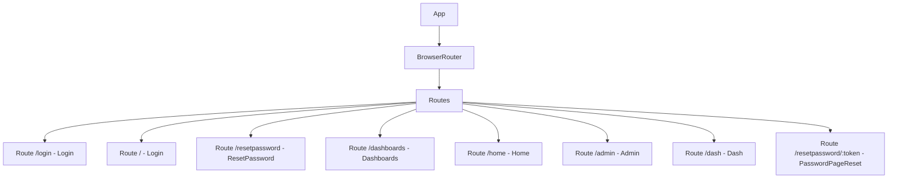

# src/App.jsx

> **Source File:** [src/App.jsx](https://github.com/test-company-prowiz/maxify_frontend/blob/main/src/App.jsx)
> **Repository:** `maxify_frontend`
> **Branch:** `main`

# src/App.jsx

### Overview
This file serves as the main entry point for the React application, configuring its top-level structure and client-side routing. It defines the core navigation paths and associates them with specific page components.

### Architecture & Role
This component is the root of the user interface layer. It orchestrates the rendering of different pages based on the URL, acting as a presentation-layer router that manages the overall application flow and user experience.

### Key Components
- `App`: The primary functional React component that encapsulates the entire application.
- `BrowserRouter`: A React Router component enabling client-side routing using the HTML5 history API.
- `Routes`: A container component for `Route` definitions, ensuring only one route matches and renders at a time.
- `Route`: Defines a specific URL path and the React component to render when that path is active.
- `API`: A globally exported constant string representing the base URL for backend API requests.
- Page Components:
    - `Login` (`./Pages/Login`): Handles user authentication.
    - `ResetPassword` (`./Pages/ResetPassword`): Initiates password reset workflows.
    - `Dashboards` (`./Pages/Dashboards`): Displays a collection of dashboards.
    - `Home` (`./Pages/Home`): Provides a main application entry point or overview.
    - `Admin` (`./Pages/Admin`): For administrative tasks.
    - `Dash` (`./Pages/Dash`): A specific dashboard view.
    - `PasswordPageReset` (`./Pages/Password`): Used for setting a new password, particularly with a reset token.

### Execution Flow / Behavior
1. The `App` component renders, initializing the `BrowserRouter` to manage URL changes without full page reloads.
2. Inside `BrowserRouter`, the `Routes` component defines a set of possible navigation paths.
3. When the browser URL matches a defined `Route` path, the corresponding element (a React component) is rendered within the `App` component's structure.
4. The application's default path (`/` and `/login`) routes to the `Login` component, making it the initial view.
5. A dynamic route `/resetpassword/:token` allows for token-based password resets, rendering the `PasswordPageReset` component.

### Dependencies
- `react-router-dom`: Provides routing capabilities (`BrowserRouter`, `Route`, `Routes`).
- `./App.css`: Stylesheet for global application styling.
- `./Pages/Login`: Core dependency for user authentication.
- `./Pages/ResetPassword`: Handles the initial password reset request.
- `./Pages/Dashboards`: Component to display a list of available dashboards.
- `./Pages/Home`: Primary landing page for authenticated users.
- `./Pages/Admin`: Provides administrative interface functionality.
- `./Pages/Dash`: Specific dashboard display component.
- `./Pages/Password`: Handles actual password update logic, including token-based resets.

### Design Notes
- The use of `react-router-dom` centralizes and simplifies client-side navigation logic, making it declarative.
- Exporting the `API` constant ensures a single source of truth for the backend endpoint, improving maintainability and configuration management.
- The `Login` component is set as the default view for both the root path (`/`) and `/login`, indicating an authentication-first design.
- The file exhibits multiple import aliases for the same component file (e.g., `KPI` and `Dash` both from `./Pages/Dash`; `Password` and `PasswordPageReset` both from `./Pages/Password`). This suggests potential for code clarity improvements, perhaps through consistent naming or component consolidation.

### Diagram
