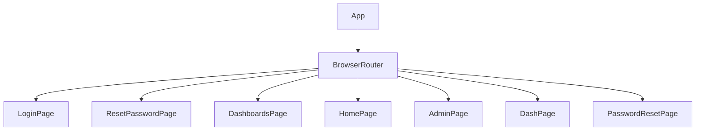

# src/App.jsx

> **Source File:** [src/App.jsx](https://github.com/test-company-prowiz/maxify_frontend/blob/main/src/App.jsx)
> **Repository:** `maxify_frontend`
> **Branch:** `main`

# src/App.jsx

### Overview
This file defines the root React component for the client-side application. Its primary purpose is to establish client-side routing using `react-router-dom` and to serve as the entry point for rendering different page components based on the URL path. It also exports a constant for the backend API base URL.

### Architecture & Role
Architecturally, this file represents the top-level component of the presentation layer in a Single-Page Application (SPA) frontend. It sits above individual page components and orchestrates which component is rendered at a given time, effectively managing the application's overall structure and navigation flow.

### Key Components
*   **`App` function**: The main functional React component responsible for rendering the application's routing structure.
*   **`API` constant**: A globally exported string constant holding the base URI for backend API calls.
*   **`BrowserRouter`**: A component from `react-router-dom` that uses the HTML5 history API to keep the UI in sync with the URL.
*   **`Routes`**: A component from `react-router-dom` that renders the first `Route` that matches the current URL.
*   **`Route`**: Components defining specific URL paths and the React elements (page components) to render when those paths are active.
*   **Page Components**: Imported components (`Login`, `ResetPassword`, `Dashboards`, `Home`, `Admin`, `Dash`, `PasswordPageReset`) that represent distinct views or pages within the application.

### Execution Flow / Behavior
When the application starts, the `App` component is rendered. It sets up `BrowserRouter` to listen for URL changes. Inside `BrowserRouter`, a `Routes` component is configured with multiple `Route` definitions. At runtime, `Routes` evaluates the current browser URL against the defined `path` props. When a match is found, the corresponding `element` (a page component like `<Login/>` or `<Dashboards/>`) is rendered, replacing any previously rendered page within the `Routes` container. The `API` constant is available for any module that imports it, providing a consistent backend endpoint.

### Dependencies
*   **`react-router-dom`**: External library providing client-side routing capabilities (`BrowserRouter`, `Route`, `Routes`).
*   **`./App.css`**: Styling for the root `App` component.
*   **Page Components**:
    *   `./Pages/Login`
    *   `./Pages/ResetPassword`
    *   `./Pages/Dashboards`
    *   `./Pages/Home`
    *   `./Pages/Admin`
    *   `./Pages/Dash`
    *   `./Pages/Password` (imported as `PasswordPageReset`)

### Design Notes
*   The `API` constant provides a centralized location for the backend URI, making it easy to configure different environments (e.g., development, staging, production).
*   The application uses a declarative routing approach, clearly defining path-to-component mappings.
*   There are multiple imports from the same file, e.g., `KPI` and `Dash` from `./Pages/Dash`, and `Password` and `PasswordPageReset` from `./Pages/Password`. While `PasswordPageReset` and `Dash` are used in routes, `KPI` and `Password` are imported but not directly utilized within the `App` component's JSX, which suggests potential dead code or aliases not leveraged in the main router.
*   The root path `/` and `/login` both map to the `<Login/>` component, acting as an alias or default landing page.
*   The route `/resetpassword/:token` utilizes a URL parameter (`:token`), indicating dynamic content based on a token embedded in the URL.

### Diagram
