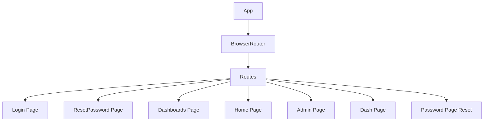

# src/App.jsx

> **Source File:** [src/App.jsx](https://github.com/test-company-prowiz/maxify_frontend/blob/main/src/App.jsx)
> **Repository:** `maxify_frontend`
> **Branch:** `main`

# src/App.jsx

### Overview
This file defines the main application component, `App`, which is responsible for setting up client-side routing using `react-router-dom`. It maps various URL paths to their corresponding page components, forming the core navigation structure of the application.

### Architecture & Role
This file serves as the entry point for the React application's user interface and routing layer. It belongs to the presentation layer, orchestrating how different views are rendered based on the browser's URL.

### Key Components
*   **`App` Function Component**: The root component that encapsulates the entire application's routing logic.
*   **`BrowserRouter`**: Enables HTML5 history API for clean URLs within the application.
*   **`Routes`**: A container for defining individual `Route` components.
*   **`Route` Components**: Each `Route` maps a specific URL `path` to a React `element` (a page component).
*   **`API` Constant**: Exports the base URI for the backend API, `https://maxify.prowiz.io`.
*   **Page Components**: Imports several page components from `./Pages/*` such as `Login`, `ResetPassword`, `Dashboards`, `Home`, `Admin`, `Dash`, and `PasswordPageReset`.

### Execution Flow / Behavior
When the application starts, the `App` component renders. The `BrowserRouter` initializes client-side routing. Based on the current browser URL, the `Routes` component matches the URL to a defined `Route` and renders the associated page component. For example, navigating to `/login` or `/` will render the `Login` component, while `/dashboards` will render the `Dashboards` component. A dynamic route `/resetpassword/:token` is handled by `PasswordPageReset`.

### Dependencies
*   **`react-router-dom`**: Provides the foundational components (`BrowserRouter`, `Route`, `Routes`) for declarative routing.
*   **`./App.css`**: Supplies global styles for the application.
*   **`./Pages/Login`**: The component for user authentication.
*   **`./Pages/ResetPassword`**: The component for initial password reset requests.
*   **`./Pages/Dashboards`**: The component for displaying multiple dashboards.
*   **`./Pages/Dash`**: The component for displaying a specific dashboard.
*   **`./Pages/Password`**: The component for handling password changes, specifically `PasswordPageReset` route.
*   **`./Pages/Admin`**: The component for administrative functions.
*   **`./Pages/Home`**: The component for the main home page.

### Design Notes
The routing is centrally managed within this `App.jsx` file, providing a clear overview of all available routes. The `API` constant is directly exported from this file, making the API endpoint readily available throughout the application. There are instances where the same component (`Dash` and `Password`) is imported with different aliases or the same path (`/` and `/login`) renders the same component, which indicates specific routing intentions or initial redirect logic. The `KPI` import is unused.

### Diagram
