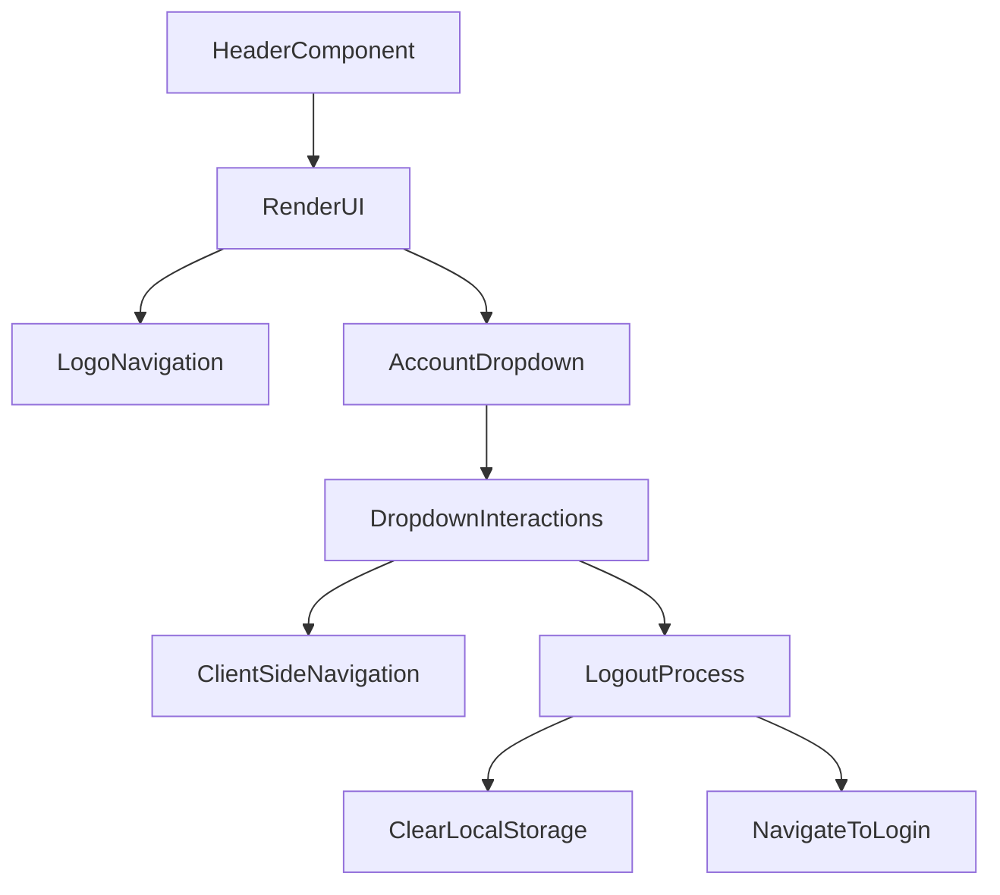

# src/Components/Header.jsx

> **Source File:** [src/Components/Header.jsx](https://github.com/test-company-prowiz/maxify_frontend/blob/main/src/Components/Header.jsx)  
> **Repository:** `maxify_frontend`  
> **Branch:** `main`

# src/Components/Header.jsx

### Overview
This file defines the `Header` React functional component, which renders the application's global header. It includes a logo that can navigate to the home page, and a "My Account" section with a hover-activated dropdown menu for navigation to home, login (with logout functionality), and password reset pages.

### Architecture & Role
The `Header` component resides in the presentation layer of the frontend architecture. It is a reusable UI component responsible for rendering a consistent top-level navigation and branding element across various application pages. It integrates with `react-router-dom` for client-side navigation.

### Key Components
*   **`Header` functional component**: The main React component that renders the header UI. It accepts `isNavigatable` and `isHomeNav` as props.
*   **`isNavigatable` prop**: A boolean prop that controls whether the logo and "Home" dropdown item trigger navigation.
*   **`isHomeNav` prop**: A boolean prop that determines the background color of the header, likely for distinguishing home page headers.
*   **`useState(false)` (`hover`)**: Manages the visibility state of the "My Account" dropdown menu.
*   **`useNavigate()`**: A hook from `react-router-dom` used for programmatic navigation between routes.

### Execution Flow / Behavior
1.  The `Header` component renders a full-width container with a logo on the left and a "My Account" button on the right.
2.  The header's background color is conditionally applied based on the `isHomeNav` prop.
3.  Clicking the logo navigates to the `/home` route, but only if the `isNavigatable` prop is `true`.
4.  Hovering over the "My Account" button toggles the `hover` state, making a dropdown menu visible or hidden.
5.  The dropdown menu contains three options:
    *   **"Home"**: Navigates to `/home` if `isNavigatable` is `true`.
    *   **"Log Out"**: Navigates to `/login` and also removes the item named "data" from `localStorage`.
    *   **"Change Password"**: Navigates to `/resetpassword`.

### Dependencies
*   **`react`**: Provides the core React library for component definition and state management (`useState`).
*   **`react-router-dom`**: Provides the `useNavigate` hook for client-side routing.
*   **`../Assets/logo.png`**: Local asset for the application's branding logo.
*   **`../Assets/Login_icon 1.svg`**: Local asset for the login icon displayed next to "My Account".
*   **`../Assets/downArrow.svg`**: Local asset for the down arrow icon in the "My Account" button.

### Design Notes
*   The component uses inline Tailwind CSS classes for styling, providing a utility-first approach to UI development.
*   The `isNavigatable` prop introduces conditional navigation logic, suggesting that the header might be used in contexts where navigation is restricted (e.g., during authentication flows).
*   Logout functionality directly manipulates `localStorage` to clear session data, which implies a client-side session management strategy.
*   The dropdown menu relies on `onMouseOver` and `onMouseOut` events for visibility, which can sometimes be less accessible than click-based toggles for certain user interfaces.

### Diagram
