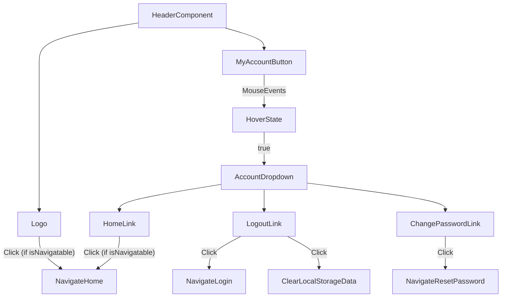

# src/Components/Header.jsx

> **Source File:** [src/Components/Header.jsx](https://github.com/test-company-prowiz/maxify_frontend/blob/main/src/Components/Header.jsx)
> **Repository:** `maxify_frontend`
> **Branch:** `main`

# src/Components/Header.jsx

### Overview
This file defines the `Header` React functional component, which serves as a consistent top navigation bar across the application. It includes a company logo, a "My Account" dropdown menu, and conditional navigation capabilities.

### Architecture & Role
This component operates within the presentation layer of the application. It is a reusable UI component intended for placement at the top of various pages, providing branding, user account access, and global navigation links.

### Key Components
*   **`Header(props)`**: The main functional component responsible for rendering the header structure.
    *   `isNavigatable` (prop): A boolean indicating whether the logo and "Home" link should trigger navigation.
    *   `isHomeNav` (prop): A boolean influencing the header's background color.
*   **`useState(false)`**: Manages the `hover` state, controlling the visibility of the "My Account" dropdown menu.
*   **`useNavigate()`**: A hook from `react-router-dom` used for programmatic navigation between routes.
*   **`logo`**: An image asset for the company logo.
*   **`loginIcon`**: An image asset for the login/account icon.
*   **`DownArrow`**: An image asset for the dropdown indicator.

### Execution Flow / Behavior
The `Header` component renders a dynamic navigation bar:
1.  The component mounts and displays the logo and "My Account" button. Its background color is determined by the `isHomeNav` prop.
2.  Clicking the logo navigates to the `/home` route if the `isNavigatable` prop is true.
3.  Hovering over the "My Account" button toggles the `hover` state, which conditionally renders a dropdown menu.
4.  The dropdown menu contains:
    *   "Home": Navigates to `/home` if `isNavigatable` is true.
    *   "Log Out": Navigates to `/login` and removes the `data` item from `localStorage`.
    *   "Change Password": Navigates to `/resetpassword`.
5.  All navigation actions utilize the `useNavigate` hook.

### Dependencies
*   **`react`**: Provides the core functionality for building UI components, including the `useState` hook for managing component state.
*   **`react-router-dom`**: Provides the `useNavigate` hook, essential for client-side routing and navigation.
*   **`../Assets/logo.png`**: Local asset for the main application logo.
*   **`../Assets/Login_icon 1.svg`**: Local asset for the login/account icon.
*   **`../Assets/downArrow.svg`**: Local asset for the dropdown arrow icon.

### Design Notes
The component utilizes Tailwind CSS classes directly within the JSX for styling, making it highly dependent on the Tailwind configuration. The `isNavigatable` prop allows for contextual control over navigation behavior, useful in scenarios where navigation might be restricted (e.g., during specific form submissions or onboarding flows). User session data management, specifically logout, directly interacts with `localStorage`, implying a client-side token or session identifier storage mechanism.

### Diagram
