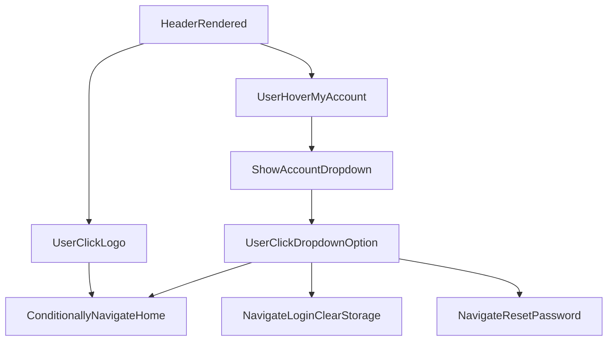

# src/Components/Header.jsx

> **Source File:** [src/Components/Header.jsx](https://github.com/test-company-prowiz/maxify_frontend/blob/main/src/Components/Header.jsx)
> **Repository:** `maxify_frontend`
> **Branch:** `main`

# src/Components/Header.jsx

### Overview
This file defines the `Header` React functional component, which renders the top navigation bar of the application. It includes the application logo, a "My Account" dropdown menu, and provides navigation links to various parts of the application, such as home, login, and change password pages.

### Architecture & Role
The `Header` component operates within the presentation layer of the frontend architecture. It is a reusable UI component responsible for rendering the primary navigation and account-related actions across different pages. It integrates with client-side routing and manages its own local UI state for the dropdown menu.

### Key Components
*   **`Header` function component**: The main React component that renders the header UI.
*   **`useState` (hover)**: A React hook used to manage the visibility state of the "My Account" dropdown menu.
*   **`useNavigate`**: A hook from `react-router-dom` enabling programmatic navigation within the application.
*   **`props`**:
    *   `isNavigatable`: A boolean prop that controls whether clicking the logo or "Home" link will trigger navigation.
    *   `isHomeNav`: A boolean prop that conditionally applies a background color to the header.

### Execution Flow / Behavior
1.  When the `Header` component renders, it displays the application logo and a "My Account" button.
2.  The header's background color is dynamically set based on the `isHomeNav` prop.
3.  Clicking the logo navigates to `/home` if the `isNavigatable` prop is `true`.
4.  Hovering over the "My Account" button (or the dropdown itself) sets the `hover` state to `true`, causing a dropdown menu to appear.
5.  Hovering out of the "My Account" area or the dropdown sets the `hover` state to `false`, hiding the dropdown.
6.  Inside the dropdown:
    *   Clicking "Home" navigates to `/home` if `isNavigatable` is `true`.
    *   Clicking "Log Out" navigates to `/login` and removes the item with key "data" from `localStorage`.
    *   Clicking "Change Password" navigates to `/resetpassword`.

### Dependencies
*   **`react`**: Provides core React functionalities, including the `useState` hook for managing component state.
*   **`react-router-dom`**: Used for client-side routing, specifically the `useNavigate` hook for programmatic navigation.
*   **`../Assets/logo.png`**: Local asset for the application's logo image.
*   **`../Assets/Login_icon 1.svg`**: Local asset for the login icon displayed in the "My Account" button.
*   **`../Assets/downArrow.svg`**: Local asset for the dropdown arrow icon.

### Design Notes
*   The component uses inline CSS classes (likely Tailwind CSS) for styling, which makes styling decisions highly coupled with the component's structure.
*   The `isNavigatable` prop offers a mechanism to conditionally enable/disable navigation from the logo and home link, which can be useful in specific application states or views.
*   The logout functionality directly manipulates `localStorage`, which is a common client-side approach for session management, though it bypasses server-side session invalidation.
*   Routes are hardcoded within the component, which could be refactored into a configuration or constants file for easier management if the application scales.

### Diagram
