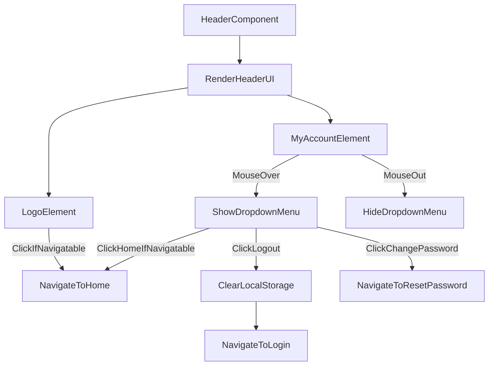

# src/Components/Header.jsx

> **Source File:** [src/Components/Header.jsx](https://github.com/test-company-prowiz/maxify_frontend/blob/main/src/Components/Header.jsx)
> **Repository:** `maxify_frontend`
> **Branch:** `main`

# src/Components/Header.jsx

### Overview
This file defines the `Header` React functional component, which provides a consistent navigation bar at the top of application pages. It includes the application logo and a user account dropdown menu, facilitating global navigation and user session management.

### Architecture & Role
This component operates at the presentation layer of the frontend application. It functions as a reusable UI element, responsible for displaying application branding and providing user-related navigation links, ensuring a consistent header across various routes.

### Key Components
*   **`Header(props)`**: The primary functional React component responsible for rendering the header UI.
    *   `isNavigatable` (prop): A boolean that controls whether certain navigation actions (e.g., clicking the logo or "Home" link) are active.
    *   `isHomeNav` (prop): A boolean that determines the background styling of the header, likely for differentiating home page appearance.
*   **`useState(false)`**: Manages the `hover` state, which controls the conditional visibility of the "My Account" dropdown menu.
*   **`useNavigate()`**: A hook from `react-router-dom` used for programmatic navigation within the application.

### Execution Flow / Behavior
1.  The `Header` component renders a navigation bar `div` at the top of the viewport. Its background color is dynamically set based on the `isHomeNav` prop.
2.  An application logo is displayed on the left side. Clicking the logo triggers navigation to the `/home` route, but only if the `isNavigatable` prop is `true`.
3.  A "My Account" section is positioned on the right, containing a login icon, text, and a dropdown arrow.
4.  Hovering over the "My Account" section sets the internal `hover` state to `true`, causing a dropdown menu to appear. Moving the mouse out of this area sets `hover` to `false`, hiding the dropdown.
5.  The dropdown menu provides three interactive options:
    *   **Home**: Navigates to the `/home` route if `isNavigatable` is `true`.
    *   **Log Out**: Navigates to the `/login` route and simultaneously removes the "data" item from `localStorage`.
    *   **Change Password**: Navigates to the `/resetpassword` route.

### Dependencies
*   **`react`**: Provides the core functionality for defining React components and managing component-local state via `useState`.
*   **`react-router-dom`**: Supplies the `useNavigate` hook, essential for client-side routing and programmatic URL changes.
*   **`../Assets/logo.png`**: A static image asset used for the application's main brand logo.
*   **`../Assets/Login_icon 1.svg`**: A static SVG image asset used as an icon within the "My Account" section.
*   **`../Assets/downArrow.svg`**: A static SVG image asset used as a visual indicator for the dropdown menu.

### Design Notes
The `Header` component demonstrates prop-driven customization for navigation behavior and styling, enhancing its reusability across different parts of the application. The dropdown menu's visibility is managed using local state and `onMouseOver`/`onMouseOut` events. Direct interaction with `localStorage` for session management (logout) is handled within the component. Styling is integrated directly using Tailwind CSS classes.

### Diagram
