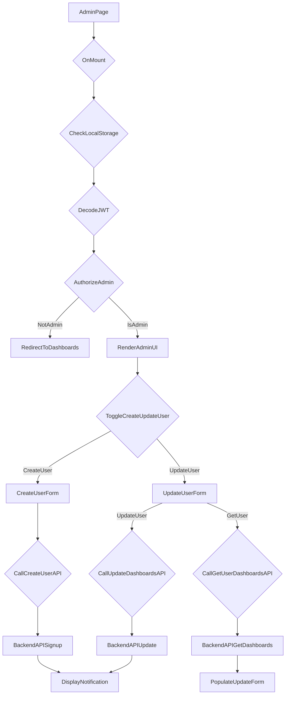

# src/Pages/Admin.jsx

> **Source File:** [src/Pages/Admin.jsx](https://github.com/test-company-prowiz/maxify_frontend/blob/main/src/Pages/Admin.jsx)
> **Repository:** `maxify_frontend`
> **Branch:** `main`

# src/Pages/Admin.jsx

### Overview
This file defines the `Admin` React component, which provides an administrative interface for managing users within the application. It allows authorized administrators to create new user accounts and update existing user dashboards.

### Architecture & Role
This component operates at the presentation layer of the application. It is a React page component responsible for rendering administrative forms and interacting with backend APIs for user management tasks. It enforces client-side administrator authorization by decoding JWT tokens.

### Key Components
*   **`Admin` Functional Component**: The primary component that renders the administrative interface, including forms for user creation and update.
*   **`useState` Hooks**:
    *   `isCreateUser`: Boolean state to toggle between user creation and user update forms.
    *   `data`: Stores fetched user data, although its display usage in JSX is limited to the current admin's own data.
    *   `loading`: Boolean state to manage UI loading indicators.
*   **`useEffect` Hook**: Executes on component mount to perform authentication checks (local storage, JWT decode for user type) and initial data fetching.
*   **`CreateUser(formData)`**: An asynchronous function that sends new user registration data to the `/admin/signup` API endpoint.
*   **`getUser(formData)`**: An asynchronous function that fetches an existing user's dashboard links from the `/auth/dashboards` API endpoint based on their email.
*   **`UpdateDashboards(formData)`**: An asynchronous function that sends updated dashboard information for an existing user to the `/admin/update` API endpoint.
*   **Ant Design Forms (`Form`, `Input`, `Button`, `Card`, `Space`)**: Used for structured data input and submission.
*   **`react-toastify` (`successNotify`, `notify`, `ToastContainer`)**: Provides UI feedback for API operation outcomes.

### Execution Flow / Behavior
1.  **Initialization**: Upon mounting, the `useEffect` hook:
    *   Checks for user data in `localStorage`. If absent, redirects to `/login`.
    *   Decodes the JWT token from `localStorage` to verify the user's `user_type`. If not "admin", it redirects to `/dashboards`.
    *   Fetches the current admin's dashboard data from `${API}/auth/dashboards`.
2.  **User Interaction**:
    *   The admin can switch between "Create User" and "Update User" modes using respective buttons, which toggles the `isCreateUser` state and resets the form.
3.  **Create User Flow**:
    *   When in "Create User" mode, a form allows input for `email`, `password`, `first_name`, and a dynamic list of `dashboards` (link and name).
    *   Upon submission via the "Create User" button, the `CreateUser` function is invoked.
    *   Dashboard links are `JSON.stringify`'d before being sent to the `/admin/signup` endpoint with the admin's token for authorization.
    *   Success or error notifications are displayed.
4.  **Update User Flow**:
    *   When in "Update User" mode, a form initially prompts for a user `email`.
    *   Clicking "Get User" triggers the `getUser` function, which fetches the specified user's existing dashboards.
    *   Fetched dashboard links (which are JSON strings) are `JSON.parse`'d and pre-populate the form for editing.
    *   The admin can add, remove, or modify dashboard entries.
    *   Upon submission via the "Update User" button, the `UpdateDashboards` function is invoked.
    *   Dashboard links are `JSON.stringify`'d again before being sent to the `/admin/update` endpoint with the admin's token.
    *   Success or error notifications are displayed.

### Dependencies
*   **`react`, `useEffect`, `useState`**: Core React library for UI construction and state management.
*   **`react-router-dom` (`Link`, `useLocation`, `useNavigate`)**: For client-side routing and programmatic navigation.
*   **`axios`**: Promise-based HTTP client for making API requests to the backend.
*   **`jwt-decode`**: Used to decode JSON Web Tokens locally to extract user information like `user_type`.
*   **`antd` (`Skeleton`, `Spin`, `Button`, `Card`, `Form`, `Input`, `Space`, `Typography`)**: A UI component library providing styled and functional components for forms, loading states, and layout.
*   **`@ant-design/icons` (`LoadingOutlined`, `CloseOutlined`)**: Icons used within Ant Design components.
*   **`react-toastify`**: For displaying highly customizable toast notifications.
*   **`../Components/Header`**: A shared header component for consistent application navigation.
*   **`../Components/Footer`**: A shared footer component.
*   **`../App` (`API`)**: Imports the base API URL for backend communication.
*   **Image Assets (`KPI`, `Heart`, `SEO`, `Marketing`)**: Imported SVG assets, although they are not used within the rendered JSX of this specific file.

### Design Notes
*   Client-side authorization check via `jwtDecode` provides immediate feedback and redirection but should be complemented by server-side authorization for all API endpoints.
*   Dashboard links are stored as JSON strings in the database, necessitating `JSON.parse` on retrieval and `JSON.stringify` on submission. This implies a specific contract with the backend for this field.
*   The initial data fetch in `useEffect` for the logged-in admin's dashboards primarily serves an authorization role rather than providing dynamic content to the "Welcome Admin" message.
*   The `form.getFieldsValue().items[0]` pattern is used consistently, suggesting the form is designed for a single user operation despite `Form.List` typically being used for multiple items.
*   Several image assets are imported but not utilized in the current `Admin.jsx` component, indicating potential dead code or intended functionality for other parts of the application.

### Diagram
