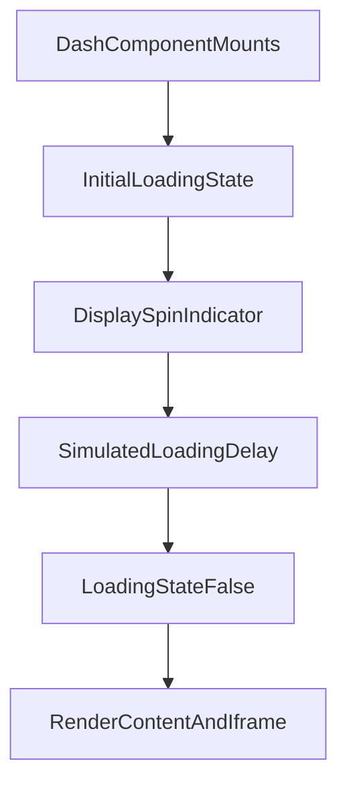

# src/Pages/Dash.jsx

> **Source File:** [src/Pages/Dash.jsx](https://github.com/test-company-prowiz/maxify_frontend/blob/main/src/Pages/Dash.jsx)
> **Repository:** `maxify_frontend`
> **Branch:** `main`

# src/Pages/Dash.jsx

### Overview
This file defines the `Dash` React functional component, which serves as a page to display external web content within an `iframe`. It includes a simulated loading state with a spinner before rendering the embedded content.

### Architecture & Role
This component resides in the `src/Pages` directory, indicating its role as a top-level view or page within the application's client-side UI. It acts as a container to present external web resources, typically navigated to via `react-router-dom` with state passed to it.

### Key Components
- `Dash` (Functional Component): The primary component for this dashboard page, responsible for orchestrating the loading state and rendering the `iframe` along with common UI elements.
- `useState` Hook: Manages the `loading` boolean state, controlling the visibility of the loading spinner.
- `useEffect` Hook: Implements a client-side delay using `setTimeout` to simulate an asynchronous loading process.
- `useLocation` Hook (from `react-router-dom`): Accesses the current route's state, specifically extracting the `data` property which contains the URL for the `iframe`.
- `Header` (Component): Renders the application's header, configured for navigability.
- `Footer` (Component): Renders the application's footer.
- `Spin` (Ant Design Component): Displays a loading indicator when the `loading` state is `true`.
- `LoadingOutlined` (Ant Design Icon): The specific icon used within the `Spin` component.
- `iframe` (HTML Element): Embeds external web content using the URL passed via router state.

### Execution Flow / Behavior
1. Upon mounting, the `Dash` component initializes its `loading` state to `true`, causing the `Spin` component to be displayed.
2. The `useEffect` hook triggers immediately after mount, setting a 2-second `setTimeout`.
3. During the 2-second delay, the `Spin` indicator remains visible.
4. After the `setTimeout` completes, the `loading` state is updated to `false`.
5. The `Spin` component unmounts, and the `iframe` becomes visible, loading its content from the URL provided in `location.state.data`.
6. The `Header` and `Footer` components are rendered consistently around the main content area.

### Dependencies
- `react`: Core library for UI development.
- `react-router-dom`: Provides client-side routing and state management through `useLocation`.
- `antd`: A UI library providing the `Spin` component and `LoadingOutlined` icon for visual feedback during loading.
- `../Components/Header`: An internal component for the page's header.
- `../Components/Footer`: An internal component for the page's footer.

### Design Notes
- The 2-second `setTimeout` in `useEffect` is a simulated loading delay. In a production scenario, this delay should be tied to actual data fetching or resource loading completion events.
- The component relies on `location.state.data` being present and containing a valid URL. Robust error handling or a default fallback for missing state data could improve resilience.
- Embedding arbitrary external content via `iframe` can introduce security risks (e.g., XSS, content spoofing) if the source URL is not properly sanitized or comes from untrusted origins.
- The `console.log(data)` statement should be removed before deployment to production.
- The `frameborder="0"` attribute on the `iframe` is a deprecated HTML attribute; CSS `border: none;` is the modern equivalent.

### Diagram
