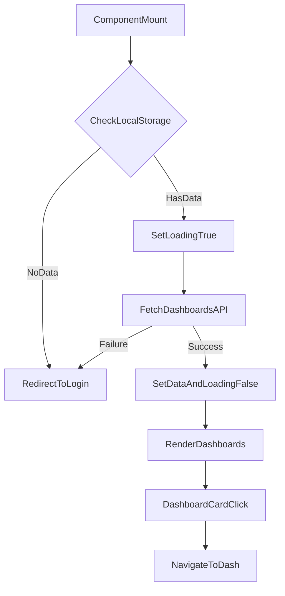

# src/Pages/Dashboards.jsx

> **Source File:** [src/Pages/Dashboards.jsx](https://github.com/test-company-prowiz/maxify_frontend/blob/main/src/Pages/Dashboards.jsx)
> **Repository:** `maxify_frontend`
> **Branch:** `main`

# src/Pages/Dashboards.jsx

### Overview
This file defines the `Dashboards` React functional component, which serves as the main dashboard page for authenticated users. It is responsible for fetching and displaying a list of dashboards associated with the logged-in user and managing session-based access control.

### Architecture & Role
This file operates within the frontend application's UI layer, specifically as a page component. It integrates with the routing system (`react-router-dom`) to represent a distinct application view and interacts with the backend API to retrieve user-specific data.

### Key Components
*   **`Dashboards` function component**: The primary component that renders the user's dashboard view.
*   **`useState` hooks**: Manages the component's internal state for `data` (user dashboards) and `loading` status.
*   **`useEffect` hook**: Handles data fetching and authentication logic on component mount and relevant state changes.
*   **`useLocation`**: Provides access to the current URL's location object, though `location.state` is primarily used for the `useEffect` dependency.
*   **`useNavigate`**: Facilitates programmatic navigation within the application, particularly for redirection to the login page.
*   **`axios`**: Used for making HTTP GET requests to the backend API.
*   **`Header`**: A shared component for the page header.
*   **`Footer`**: A shared component for the page footer.
*   **`Skeleton`**: An Ant Design component used to display placeholder loading states for text and dashboard cards.

### Execution Flow / Behavior
1.  When the `Dashboards` component mounts, an `useEffect` hook is triggered.
2.  Inside `useEffect`, the `getData` async function is invoked, setting the `loading` state to `true`.
3.  `getData` first checks for a `data` item in `localStorage`.
4.  If `localStorage.getItem('data')` is `null`, the user is redirected to the `/login` route, indicating an unauthenticated session.
5.  If user data is found in `localStorage`, it is parsed, and an API request is made to `${API}/auth/dashboards` using the user's email.
6.  Upon successful API response, the `data` state is updated with the fetched dashboards, and `loading` is set to `false`.
7.  If the API call fails, an error is logged, and the user is redirected to the `/login` route.
8.  The component conditionally renders a welcome message with the user's first name (showing a `Skeleton` while loading) and a grid of dashboard cards.
9.  During loading, `Skeleton` components are rendered as placeholders for each dashboard card.
10. If `data?.dashboards` is an empty array after loading, a "No Dashboards Available" message is displayed.
11. Clicking a dashboard card navigates the user to the `/dash` route, passing the selected dashboard's `link` data via `location.state`.
12. Static quick links to an external website are also provided.

### Dependencies
*   **`react`**: Core library for building UI components.
*   **`react-router-dom`**: Provides routing capabilities (`Link`, `useLocation`, `useNavigate`).
*   **`axios`**: HTTP client for making API requests.
*   **`antd`**: UI library providing `Skeleton` and `Spin` components for loading feedback.
*   **`@ant-design/icons`**: Provides icons, specifically `LoadingOutlined`.
*   **`../Components/Header`**: Provides the application's header UI.
*   **`../Components/Footer`**: Provides the application's footer UI.
*   **`../Assets/*`**: Static image assets used for dashboard icons.
*   **`../App`**: Provides the base `API` URL for backend communication.

### Design Notes
*   **Session Management**: User session state is managed via `localStorage`, which is checked directly by the component. This implies a reliance on the client to maintain session data.
*   **Authentication Flow**: The component enforces a redirect to the `/login` page if session data is missing or the backend API call fails, acting as a client-side gatekeeper for dashboard access.
*   **Loading States**: `Skeleton` components from Ant Design are used effectively to provide visual feedback during data fetching, improving user experience.
*   **Hardcoded Images**: Dashboard icons (`KPI`, `Heart`, etc.) are imported as static assets, implying a fixed set of icons rather than dynamic assignment.
*   **Error Handling**: Basic error handling redirects to login, but more granular error messages for different failure scenarios could enhance user experience.
*   **`location.state` usage**: The `useEffect` dependency array includes `location.state` which, while technically correct if state changes should trigger a re-fetch, might be over-sensitive or unnecessary if `location.state` is only intended for initial navigation. The `navigate` dependency is appropriate.

### Diagram
