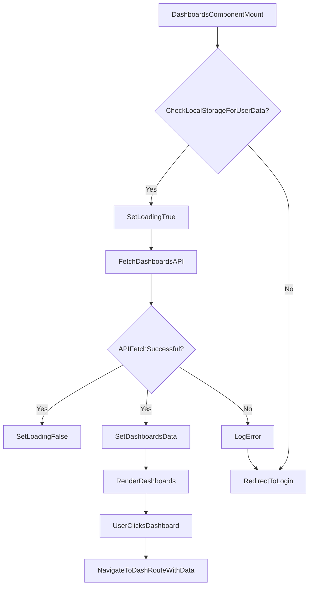

# src/Pages/Dashboards.jsx

> **Source File:** [src/Pages/Dashboards.jsx](https://github.com/test-company-prowiz/maxify_frontend/blob/main/src/Pages/Dashboards.jsx)
> **Repository:** `maxify_frontend`
> **Branch:** `main`

# src/Pages/Dashboards.jsx

### Overview
This file implements the `Dashboards` React functional component, which serves as a user's main landing page after authentication. It is responsible for fetching and displaying a list of available dashboards specific to the logged-in user, and providing navigation to individual dashboard views.

### Architecture & Role
This file operates within the client-side UI layer as a page-level component. It integrates with the application's routing system (`react-router-dom`) to manage navigation and leverages a backend API for data retrieval. It acts as a view orchestrator, combining data fetching logic with presentational components.

### Key Components
-   **`Dashboards` function:** The main React functional component responsible for rendering the dashboards page.
-   **`useState` hooks:** Manage component state for `data` (fetched dashboards), `loading` status, and `location` (current URL state).
-   **`useEffect` hook:** Handles data fetching from the backend upon component mount or when `location.state` or `navigate` dependencies change. It also manages redirection based on authentication status or errors.
-   **`Header` component:** Renders the application header.
-   **`Footer` component:** Renders the application footer.
-   **`Link` component (from `react-router-dom`):** Used for external navigation to "Quick Links".
-   **`useLocation` hook (from `react-router-dom`):** Accesses the current URL's location object, though its `state` property is primarily for dependency tracking in `useEffect` rather than direct data consumption in this version.
-   **`useNavigate` hook (from `react-router-dom`):** Provides programmatic navigation capabilities.
-   **`axios`:** HTTP client used for making API requests to the backend.
-   **`API` constant:** Base URL for API endpoints.
-   **`Skeleton`, `Spin` (from `antd`):** UI components for displaying loading placeholders and indicators.
-   **`LoadingOutlined` (from `@ant-design/icons`):** Icon for the spinning loading indicator.

### Execution Flow / Behavior
1.  When the `Dashboards` component mounts, the `useEffect` hook initiates.
2.  It sets the `loading` state to `true`.
3.  It checks `localStorage` for stored user data.
    *   If no user data is found, the user is redirected to the `/login` page.
    *   If user data exists, it parses the user object to extract the email.
4.  An `axios.get` request is made to `${API}/auth/dashboards?email={user.email}` to fetch dashboard data.
5.  Upon successful data retrieval:
    *   The `loading` state is set to `false`.
    *   The `data` state is updated with the fetched dashboards.
6.  If the API request fails, an error is logged, and the user is redirected to the `/login` page.
7.  The component renders a `Header`, a welcome message (with a skeleton loader for the user's first name while loading), a list of dashboards, and a `Footer`.
8.  While `loading` is true, `Skeleton` components are rendered as placeholders for the dashboard cards.
9.  Once data is loaded, dashboard items are mapped and displayed as clickable cards.
10. Clicking a dashboard card triggers navigation to the `/dash` route, passing the parsed dashboard `link` data via `location.state`.
11. If no dashboards are available, a "Sorry No Dashboards Available For User !!" message is displayed.
12. "Quick Links" are provided, allowing navigation to external Dashworx web pages.

### Dependencies
-   **Internal Components:**
    -   `../Components/Header`: Provides the application's header.
    -   `../Components/Footer`: Provides the application's footer.
    -   `../App`: Exports the `API` constant for backend communication.
-   **Internal Assets:**
    -   `../Assets/kpi.svg`: Used as the icon for dashboard cards.
    -   `../Assets/heart.svg`, `../Assets/SEO_magify 1.svg`, `../Assets/Marketing.svg`: Imported but not actively used within this component.
-   **External Libraries:**
    -   `react`: Core library for building UI components.
    -   `react-router-dom`: For client-side routing, navigation, and location management (`Link`, `useLocation`, `useNavigate`).
    -   `axios`: For making HTTP requests to the backend API.
    -   `antd`: Provides UI components like `Skeleton` and `Spin` for loading states.
    -   `@ant-design/icons`: Provides icons, specifically `LoadingOutlined`.

### Design Notes
-   **Authentication Flow:** The component relies on `localStorage` to check for user session data. If absent or an API error occurs, it enforces a redirect to the login page. This approach assumes `localStorage` is the primary mechanism for session persistence on the client side.
-   **Data Fetching:** Data fetching is encapsulated within a `useEffect` hook, which is a standard pattern for side effects in React functional components. The dependency array includes `location.state` and `navigate`, ensuring re-execution if these change, though `location.state`'s direct usage is commented out.
-   **User Experience:** Skeleton loaders from Ant Design are used to improve perceived performance during data fetching, providing visual feedback to the user.
-   **Redundancy:** Several asset imports (`Heart`, `SEO`, `Marketing`) are present but not utilized in the current render logic, indicating potential for cleanup or future expansion.
-   **Dashboard Link Handling:** The dashboard `item.link` is expected to be a JSON string that needs parsing before being passed to the `/dash` route. This implies the `dash` component expects a parsed object.

### Diagram
