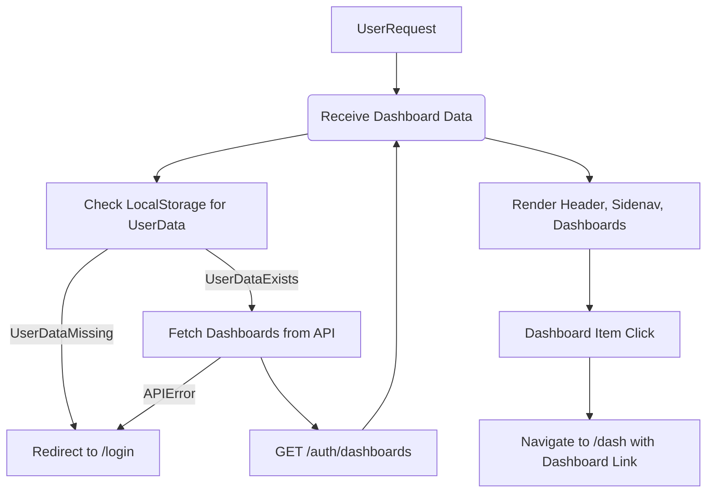

# src/Pages/Home.jsx

> **Source File:** [src/Pages/Home.jsx](https://github.com/test-company-prowiz/maxify_frontend/blob/main/src/Pages/Home.jsx)
> **Repository:** `maxify_frontend`
> **Branch:** `main`

# src/Pages/Home.jsx

### Overview
This file defines the `Home` React functional component, which serves as the primary dashboard view for authenticated users. It is responsible for fetching and displaying a list of available dashboards, presenting navigation options, and showing user-specific information.

### Architecture & Role
This component operates within the presentation layer of the frontend application. It acts as a page-level container, orchestrating data fetching from the backend API and rendering the main user interface. It integrates with client-side routing to manage navigation and authentication state.

### Key Components
- **`Home` Function Component**: The main component responsible for rendering the home page content.
- **`useState` Hooks**: Manage the `data` state for fetched dashboards and the `loading` state during API calls.
- **`useEffect` Hook**: Handles initial data fetching and authentication checks upon component mount or specific dependency changes.
- **`useLocation`, `useNavigate` Hooks**: From `react-router-dom`, used for accessing current route information and programmatic navigation.
- **`Header`**: A reusable component for the application's top navigation bar.
- **`Skeleton` (from `antd`)**: Provides a loading placeholder experience while data is being fetched.
- **`Link` (from `react-router-dom`)**: Used for declarative navigation to other internal and external routes.
- **`axios`**: An HTTP client used for making API requests to the backend.

### Execution Flow / Behavior
1. Upon mounting, the `useEffect` hook is triggered to initiate data fetching.
2. It first checks `localStorage` for a `data` item, which is expected to contain user authentication details.
3. If no user data is found in `localStorage`, the user is redirected to the `/login` route.
4. If user data is present, a `loading` state is activated, and an `axios.get` request is made to `${API}/auth/dashboards` using the user's email.
5. During the API request, `Skeleton` components are rendered as placeholders for the welcome message and dashboard items.
6. On successful API response, the `loading` state is deactivated, and the fetched dashboard `data` is stored in the component's state.
7. The component then renders the `Header`, a side navigation (`sidenav`) displaying links for "Dashboards", "High Level Insights", "Contact Dashworx", and "Upgrade Plan", along with a welcome message including the user's first name.
8. A grid of available dashboards is displayed. Each dashboard item is clickable.
9. Clicking a dashboard item navigates the user to the `/dash` route, passing the specific dashboard's `link` data via `location.state`.
10. If the API request fails or encounters an error, the user is redirected to the `/login` route.
11. If no dashboards are returned by the API, a "Sorry No Dashboards Available For User !!" message is displayed.

### Dependencies
- **`react`**: Core library for building user interfaces.
- **`react-router-dom`**: Provides client-side routing capabilities (`Link`, `useLocation`, `useNavigate`).
- **`axios`**: Promise-based HTTP client for making API requests.
- **`antd`**: UI library, specifically `Skeleton` for loading states.
- **`../Components/Header`**: Internal component for consistent page headers.
- **`../Assets/*.svg`**: Static assets for various icons used in the UI.
- **`../App`**: Provides the global `API` constant for backend endpoint configuration.

### Design Notes
- **Client-Side Authentication**: The component relies on `localStorage` for session management, checking for user data to determine authentication status. This pattern requires careful consideration for security and session invalidation.
- **Loading Experience**: The use of `antd`'s `Skeleton` provides a good user experience by indicating that content is loading, rather than displaying a blank page.
- **External Links**: Direct links to "Contact Dashworx" and "Upgrade Plan" are hardcoded, pointing to external websites for support and billing.
- **Hardcoded Plan**: The "Current Plan : Premium" text in the sidebar is static, suggesting it might be a placeholder or a simplified representation.
- **Styling**: Utilizes Tailwind CSS classes for layout and visual presentation.

### Diagram
