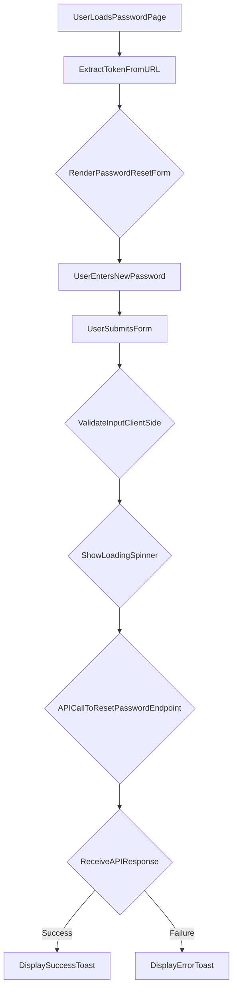

# src/Pages/Password.jsx

> **Source File:** [src/Pages/Password.jsx](https://github.com/test-company-prowiz/maxify_frontend/blob/main/src/Pages/Password.jsx)
> **Repository:** `maxify_frontend`
> **Branch:** `main`

# src/Pages/Password.jsx

### Overview
This file defines the `PasswordPageReset` React component, which provides a user interface for resetting a user's password. It captures a new password from the user and sends it to the backend API along with a reset token obtained from the URL parameters.

### Architecture & Role
This file functions as a client-side page component within the frontend application. It resides in the presentation layer, handling user input, form validation, and direct interaction with the authentication service of the backend API to perform a password reset operation.

### Key Components
*   **`PasswordPageReset` (Function Component)**: The primary React component responsible for rendering the password reset form and managing its state and logic.
*   **`useParams` (react-router-dom)**: Hook used to extract the `token` parameter from the URL, which is essential for identifying the specific password reset request.
*   **`useState` (React)**: Manages local component state, including `loading` status, `isPassVisible` (though currently unused), `emailField` (controls form section visibility, always true in active code), and `successPage` (currently inactive).
*   **`useForm` (react-hook-form)**: Provides robust form management, including registration of input fields, handling submission, validating input, and tracking form state.
*   **`onSubmit` (Async Function)**: Handles the form submission logic. It makes an `axios.post` request to the backend API to reset the password, updates loading state, and displays notifications.
*   **`ToastContainer`, `toast` (react-toastify)**: Used for displaying success and error messages to the user.
*   **`Spin`, `LoadingOutlined` (antd, ant-design/icons)**: Renders a loading spinner during API requests.

### Execution Flow / Behavior
1.  Upon loading, the `PasswordPageReset` component retrieves a `token` from the URL parameters.
2.  It renders a form prompting the user to enter a "New Password".
3.  The form uses `react-hook-form` for client-side validation, marking the password field as required.
4.  When the user submits the form, the `handleSubmit` function from `useForm` triggers the `onSubmit` asynchronous function.
5.  The `onSubmit` function sets the `loading` state to `true`, displaying a spinner.
6.  An `axios.post` request is made to `${API}/auth/resetpassword/${token}` with the new password.
7.  Upon successful response from the API, the `loading` state is set to `false`, and a success notification ("Password Changed Successfully") is displayed using `react-toastify`.
8.  If the API call fails, the `loading` state is set to `false`, and an error notification containing the API's error detail is shown.
9.  The `ToastContainer` at the bottom of the page renders the actual toast notifications.

### Dependencies
*   **`react`**: Core library for building user interfaces.
*   **`useState`**: React hook for managing component state.
*   **`logo` (./Assets/logo.png)**: Image asset used for the application logo display.
*   **`useForm` (react-hook-form)**: Library for efficient form validation and management.
*   **`Link`, `useNavigate`, `useParams` (react-router-dom)**: Hooks for declarative navigation, programmatic navigation, and accessing URL parameters, respectively.
*   **`App` (../App)**: Imports the `API` constant, which is the base URL for backend API requests.
*   **`axios`**: Promise-based HTTP client for making API requests to the backend.
*   **`ToastContainer`, `toast` (react-toastify)**: Library for displaying notification messages.
*   **`Spin` (antd)**: Ant Design component for displaying loading status.
*   **`LoadingOutlined` (@ant-design/icons)**: Icon from Ant Design used within the `Spin` component.

### Design Notes
*   The component relies heavily on `react-hook-form` for efficient form handling and validation, reducing boilerplate.
*   State variables like `isPassVisible` and `successPage` are declared but not actively used or modified in the current functional code, indicating either incomplete features or commented-out functionality.
*   There are commented-out sections of JSX and JavaScript logic, particularly related to an "emailField" and a "successPage", suggesting that the component's functionality might have been designed for a multi-step password reset process or different display states that are currently disabled.
*   The `API` constant is imported from `../App`, centralizing the API base URL configuration.
*   Direct API interaction through `axios` means the component is tightly coupled with the backend's authentication endpoint.

### Diagram 
