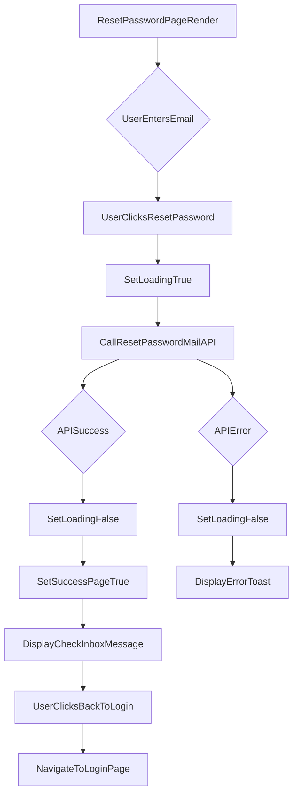

# src/Pages/ResetPassword.jsx

> **Source File:** [src/Pages/ResetPassword.jsx](https://github.com/test-company-prowiz/maxify_frontend/blob/main/src/Pages/ResetPassword.jsx)
> **Repository:** `maxify_frontend`
> **Branch:** `main`

# src/Pages/ResetPassword.jsx

### Overview
This file implements the `ResetPassword` React component, which provides a user interface for initiating a password reset process. It allows users to submit their email address to receive a password reset link.

### Architecture & Role
This file resides in the `src/Pages` directory, indicating its role as a top-level UI page within the frontend application. It functions as a client-side view responsible for user interaction related to password recovery, interacting with the backend API to trigger email delivery. It belongs to the presentation layer of the frontend architecture.

### Key Components
*   **`ResetPassword` function component:** The main React component that renders the password reset form and handles its logic.
*   **`useState` hooks:** Manage component state, including `loading` for API call status, `isPassVisible` (unused in current implementation), `emailField` (always true in current implementation), and `successPage` to conditionally render post-submission messages.
*   **`useForm` from `react-hook-form`:** Manages form state, validation, and submission for the email input.
*   **`useNavigate` from `react-router-dom`:** Enables programmatic navigation to other routes, specifically to the login page.
*   **`onSubmit` function:** An asynchronous handler for the form submission. It sends an HTTP GET request to the backend API to initiate the password reset email process.
*   **`notify` and `successNotify`:** Functions using `react-toastify` to display error and success messages to the user.

### Execution Flow / Behavior
1.  Upon initial render, the `ResetPassword` component displays a form prompting the user for their email address and a "Reset Password" button.
2.  When the user submits the form, the `handleSubmit` function from `react-hook-form` invokes the `onSubmit` handler.
3.  The `onSubmit` function sets the `loading` state to `true`, displaying a spinner, and then makes an `axios.get` request to the `${API}/auth/resetpassword/mail` endpoint, passing the entered email as a query parameter.
4.  If the API call is successful, `loading` is set to `false`, and `successPage` is set to `true`. The UI then updates to display a "Check your Inbox" message and a "Back to Login" button.
5.  If the API call fails, `loading` is set to `false`, and an error message received from the API is displayed using `toast.error`.
6.  Clicking the "Back to Login" button (available on both initial render and success page) navigates the user to the `/login` route.

### Dependencies
*   **`react`**: Core library for building UI components.
*   **`useState`**: React Hook for managing component-level state.
*   **`../Assets/logo.png`**: Local asset for the application's logo.
*   **`react-hook-form`**: External library for efficient form management and validation.
*   **`react-router-dom`**: Provides routing capabilities, specifically `Link` for navigation and `useNavigate` for programmatic redirects.
*   **`../App`**: Imports the `API` constant, which likely defines the base URL for backend API endpoints.
*   **`axios`**: HTTP client for making API requests to the backend.
*   **`react-toastify`**: Library for displaying toast notifications.
*   **`antd`**: UI component library, specifically used for the `Spin` component to indicate loading states.
*   **`@ant-design/icons`**: Provides icons, specifically `LoadingOutlined` for the spinner.

### Design Notes
*   The component leverages `react-hook-form` for streamlined form state management and validation, reducing boilerplate.
*   Conditional rendering based on the `loading` and `successPage` states provides clear user feedback during the password reset process.
*   The current implementation uses an HTTP GET request to trigger the password reset email. Conventionally, actions that initiate a state change on the server (like sending an email) are typically performed using an HTTP POST request. This might be an area for review.
*   There is significant commented-out code that suggests previous iterations or planned features, such as a multi-step password reset form that would also handle setting a new password directly on the page, or a different API endpoint for direct password change. The current active code only handles the email initiation step.

### Diagram
