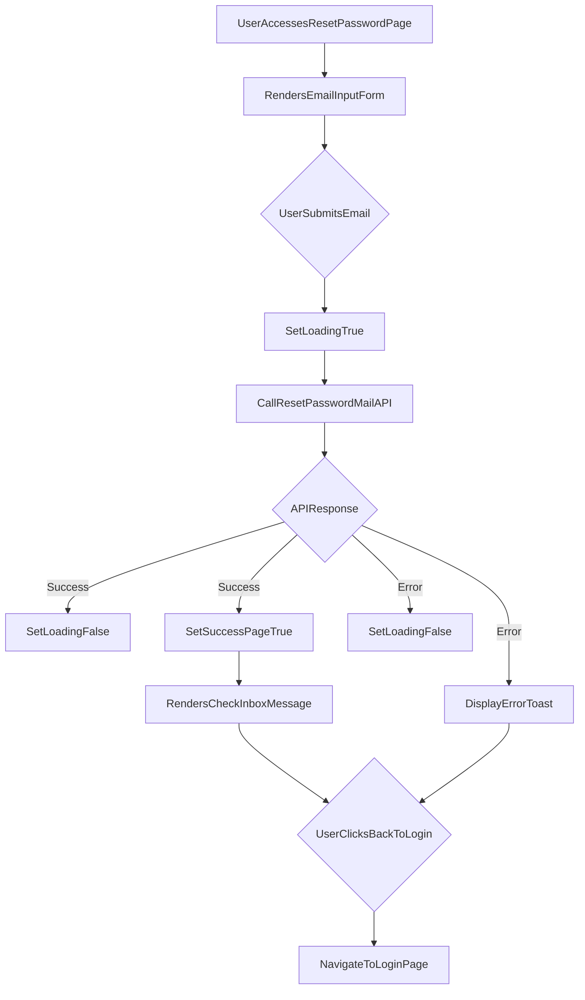

# src/Pages/ResetPassword.jsx

> **Source File:** [src/Pages/ResetPassword.jsx](https://github.com/test-company-prowiz/maxify_frontend/blob/main/src/Pages/ResetPassword.jsx)
> **Repository:** `maxify_frontend`
> **Branch:** `main`

# src/Pages/ResetPassword.jsx

### Overview
This file implements the `ResetPassword` React component, which provides a user interface for initiating a password reset process. It allows users to submit their email address to receive a password reset link.

### Architecture & Role
This component resides in the presentation layer of the application, specifically within the `Pages` directory, indicating it serves as a top-level view or route. It is responsible for rendering the password reset form and handling user interactions related to requesting a password reset email.

### Key Components
*   **`ResetPassword` Function Component**: The primary React functional component responsible for rendering the password reset UI and managing its state.
*   **`useState` Hooks**: Used for managing UI state such as loading indicators (`loading`), password field visibility (`isPassVisible`), email field display (`emailField`), and success page display (`successPage`).
*   **`useForm` Hook (from `react-hook-form`)**: Manages form state, validation, and submission for the email input field.
*   **`useNavigate` Hook (from `react-router-dom`)**: Enables programmatic navigation within the application, for example, redirecting to the login page.
*   **`onSubmit` Function**: An asynchronous handler that sends the user's email to the backend API to initiate the password reset process.
*   **`ToastContainer`, `toast` (from `react-toastify`)**: Components and functions for displaying transient success or error notifications to the user.
*   **`Spin`, `LoadingOutlined` (from `antd`, `@ant-design/icons`)**: Used to display a loading spinner while an API request is in progress.

### Execution Flow / Behavior
1.  When the `ResetPassword` component mounts, it renders a form prompting the user for their email address.
2.  Upon form submission, the `handleSubmit` function from `react-hook-form` invokes the `onSubmit` handler.
3.  The `onSubmit` handler sets the `loading` state to `true`, displaying a spinner.
4.  It then makes an `HTTP GET` request to `${API}/auth/resetpassword/mail` with the provided email as a query parameter using `axios`.
5.  If the API call is successful:
    *   The `loading` state is set to `false`.
    *   The `successPage` state is set to `true`, which conditionally renders a message instructing the user to check their inbox.
6.  If the API call fails:
    *   The `loading` state is set to `false`.
    *   An error notification is displayed using `toast.error`, showing the error detail received from the API.
7.  From the success message page, a "Back to Login" button allows the user to navigate to the `/login` route.

### Dependencies
*   **`react`**: Core library for building the user interface.
*   **`react-router-dom`**: Provides routing capabilities, including `Link` for navigation and `useNavigate` for programmatic redirects.
*   **`react-hook-form`**: A library for efficient form management and validation.
*   **`axios`**: A promise-based HTTP client for making API requests to the backend.
*   **`react-toastify`**: For displaying user feedback messages (success/error toasts).
*   **`antd`**: A UI library that provides the `Spin` component for loading indicators.
*   **`@ant-design/icons`**: Provides the `LoadingOutlined` icon used within the `Spin` component.
*   **`../Assets/logo.png`**: A local image asset for branding displayed on the page.
*   **`../App`**: Imports the `API` constant, which is the base URL for backend API calls.

### Design Notes
*   The component uses conditional rendering (`loading`, `successPage`, `emailField`) to manage the different states of the password reset flow.
*   There are commented-out sections in the code that suggest an alternative or previous implementation where the user would directly enter a new password on this page, rather than receiving an email. The current active implementation focuses solely on sending a reset email.
*   Error messages from the backend are directly displayed to the user via `react-toastify`, providing immediate feedback.
*   The design integrates a loading spinner to enhance user experience during API calls.

### Diagram
