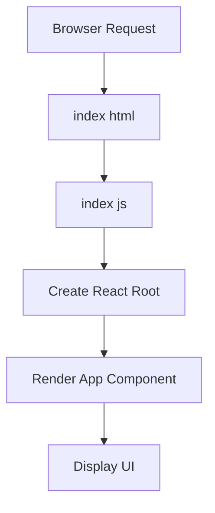

# src/index.js

> **Source File:** [src/index.js](https://github.com/maxify_frontend/blob/main/src/index.js)  
> **Repository:** `maxify_frontend`  
> **Branch:** `main`

### Overview
This file serves as the main entry point for the React application. It is responsible for bootstrapping the React environment, mounting the primary `App` component into the Document Object Model (DOM), and initializing performance monitoring utilities.

### Architecture & Role
This file operates at the client-side presentation layer, specifically as the top-level orchestrator for the React UI framework. It bridges the static `index.html` document with the dynamic React component tree, making it the root of the application's interactive user interface.

### Key Components
*   `ReactDOM.createRoot`: A function from `react-dom/client` used to create a new React root for concurrent mode rendering.
*   `root.render`: A method of the created React root that renders a React element into the DOM.
*   `App` component: The main, top-level functional component of the application, defined in `./App.js`.
*   `reportWebVitals`: A utility function imported from `./reportWebVitals.js` used to measure and log performance metrics (web vitals).

### Execution Flow / Behavior
1.  The necessary modules (`React`, `ReactDOM`, `./index.css`, `./App`, `reportWebVitals`) are imported.
2.  The script locates the HTML element with the ID `root` in the document.
3.  A React root is created on this DOM element using `ReactDOM.createRoot`.
4.  The `App` component is rendered inside `React.StrictMode` into the created React root. This initiates the rendering of the entire application's UI.
5.  A conditional statement, which evaluates to true (`"prod" !== "development"`), reassigns `console.log` to an empty function, effectively silencing all `console.log` output throughout the application.
6.  The `reportWebVitals()` function is called, which initiates the measurement and reporting of web performance metrics.

### Dependencies
*   `react`: The core library for building user interfaces.
*   `react-dom/client`: Provides DOM-specific methods for React, essential for rendering React components into the browser's DOM using the modern `createRoot` API.
*   `./index.css`: Imports global CSS styles that apply to the entire application.
*   `./App`: Imports the root application component that encapsulates the primary user interface structure and logic.
*   `./reportWebVitals`: A local utility module responsible for gathering and reporting on web vital performance metrics.

### Design Notes
*   The use of `ReactDOM.createRoot` indicates adherence to React 18's new client-side rendering API, enabling concurrent features.
*   `React.StrictMode` is enabled for the entire application, providing development-time warnings and checks for potential issues within components.
*   The code includes a global override for `console.log`, effectively disabling all console output. This is likely intended for production builds to prevent logging, although the condition `"prod" !== "development"` unconditionally triggers it as written.
*   Integration with `reportWebVitals` highlights a focus on application performance monitoring and user experience, aiming to track Core Web Vitals.

### Diagram (Optional)
