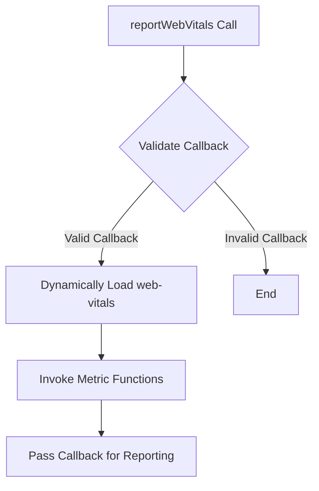

# src/reportWebVitals.js

> **Source File:** [src/reportWebVitals.js](https://github.com/maxify_frontend/blob/main/src/reportWebVitals.js)  
> **Repository:** `maxify_frontend`  
> **Branch:** `main`

### Overview
This file provides a utility function, `reportWebVitals`, for asynchronously measuring and reporting Core Web Vitals metrics such as CLS, FID, FCP, LCP, and TTFB. It dynamically loads the `web-vitals` library and passes a provided callback to its measurement functions.

### Architecture & Role
This file operates on the client-side as a performance monitoring utility. It is designed to be integrated into the entry point of a web application (e.g., `index.js` in a React application) to initiate the collection and reporting of user experience metrics. Its role is to bridge the application's performance reporting mechanism with the `web-vitals` library.

### Key Components
*   `reportWebVitals`: The default exported function that takes a callback (`onPerfEntry`) responsible for handling the collected performance entries.
*   `getCLS`, `getFID`, `getFCP`, `getLCP`, `getTTFB`: Functions imported from the `web-vitals` library that register a callback to measure and report specific performance metrics.

### Execution Flow / Behavior
1.  The `reportWebVitals` function is invoked with an `onPerfEntry` callback.
2.  It first validates if `onPerfEntry` is a valid function.
3.  If valid, it dynamically imports the `web-vitals` library, deferring its load until needed.
4.  Upon successful import, it destructs the individual metric measurement functions (e.g., `getCLS`, `getFID`).
5.  Each of these measurement functions is then called, passing the original `onPerfEntry` callback. The `web-vitals` library will subsequently invoke this callback when a performance entry for the respective metric is recorded.

### Dependencies
*   `web-vitals`: An external JavaScript library that provides functions for measuring Core Web Vitals. This dependency is loaded dynamically at runtime.

### Design Notes
*   **Dynamic Import**: The use of `import('web-vitals')` ensures that the `web-vitals` library is only loaded when performance reporting is explicitly enabled and a valid callback is provided. This defers the download of the library, contributing to faster initial page load times for users who might not require this functionality or in environments where it is disabled.
*   **Callback Validation**: The initial check (`onPerfEntry && onPerfEntry instanceof Function`) provides robustness by ensuring that the provided callback is a callable function before attempting to use it, preventing runtime errors.

### Diagram (Optional)
